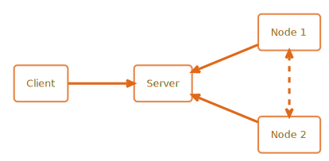

::: questions
This are the questions
:::

::: objectives
-   List the high-level infrastructure components of v6 (server, client, node)
-   Understand the added value of v6
-   Understand that there is different actors in algorithms
-   Understand that the v6 server does not run algorithms
-   Explain how a simple analysis runs on v6
-   Understand the future of vantage6 (policies, etc.)
:::

## The vantage6 infrastructure

In vantage6, a **client** can pose a question to the central **server**. Each organization with sensitive data contributes one **node** to the network. The nodes collects the research question from the server and fetches the **algorithm to answer** it. When the algorithm completes, the node sends the aggregated results back to the server.

The roles of these vantage6 components are as follows:

-   A (central) **server** coordinates communication with clients and nodes. The server tracks the status of the computation requests and handles administrative functions such as authentication and authorization.

-   **Node(s)** have access to data and execute algorithms

-   **Clients** (i.e. users or applications) request computations from the nodes via the client

-   **Algorithms** are scripts that are run on the sensitive data. Each algorithm is packaged in a Docker image; the node pulls the image from a Docker registry and runs it on the local data. Note that the node owner can control which algorithms are allowed to run on their data.

On a technical level, vantage6 may be seen as a (Docker) container orchestration tool for privacy preserving analyses. It deploys a network of containerized applications that together ensure insights can be exchanged without sharing record-level data.

## The vantage 6 architecture

As we saw before, the vantage6 network consists of a central server, a number of nodes and a client. This section explains in some more detail what these network actors are responsible for, and which subcomponents they contain.

### Server

The vantage6 server is the central point of contact for all communication in vantage6. However, it also relies on other infrastructure components to function properly. The following components are required for proper functioning of the server.

-   **Vantage6 server** Contains the users, organizations, collaborations, tasks and their results. It handles authentication and authorization to the system and is the central point of contact for clients and nodes.

-   **Docker registry** Contains algorithms stored in images which can be used by clients to request a computation. The node will retrieve the algorithm from this registry and execute it.

-   **Algorithm store** Is intended to be used as a repository for trusted algorithms within a certain project. Algorithm stores can be coupled to specific collaborations or to all collaborations on a given server.

-   **VPN server** If algorithms need to be able to engage in peer-to-peer communication, a VPN server can be set up to help them do so. This is usually the case when working with MPC, and is also often required for machine learning applications.

-   **RabbitMQ message queue** The vantage6 server uses the socketIO protocol to communicate between server, nodes and clients. If there are multiple instances of the vantage6 server, it is important that the messages are communicated to all relevant actors, not just the ones that a certain server instance is connected to. RabbitMQ is therefore used to synchronize the messages between multiple vantage6 server instances.

### Data Station

-   **Vantage6 node** The node is responsible for executing the algorithms on the local data. It protects the data by allowing only specified algorithms to be executed after verifying their origin. The node is responsible for picking up the task, executing the algorithm and sending the results back to the server. The node needs access to local data. For more details see the technical documentation of the node.

-   **Database** The database may be in any format that the algorithms relevant to your use case support. The currently supported database types are listed here.

-   **Algorithm** When the node receives a task from the central server, it will download the algorithm from the Docker registry and execute it on the local data. The algorithm is therefore a temporary component that is automatically created by the node and only present during the execution of a task.

### User or Application

Users or applications can interact with the vantage6 server in order to create tasks and retrieve their results, or manage entities at the server (i.e. creating or editing users, organizations and collaborations).

The vantage6 server is an API, which means that there are many ways to interact with it programatically. There are however a number of applications available that make is easier for users to interact with the vantage6 server. These are explained in more detail in the User guide but are also briefly mentioned here:

-   **User interface** The user interface is a web application that allows users to interact with the server. It is used to create and manage organizations, collaborations, users, tasks and algorithms. It also allows users to view and download the results of tasks. Use of the user interface recommended for ease of use.

-   **Python client** The vantage6 python client <python-client> is a Python package that allows users to interact with the server from a Python environment. This is helpful for data scientists who want to integrate vantage6 into their existing Python workflow.

-   **API** It is also possible to interact with the server using the API directly.

## How do algorithms run in vantage6

Federated algorithms can be split in a federated and a central part. The federated part uses the data to perform local computation. The central part is the aggregation of these results. In order to do so, it is also responsible to start the federated parts and to collecting their results. For simple algorithms the process can consist of a single iteration, but for more complex algorithms, this can be an iterative process: the central part can send new tasks to the federated parts based on the results of the previous round of federated tasks.

Now, let’s see how this works in vantage6. The user creates a task for the central part of the algorithm. This is registered at the server, and leads to the creation of a central algorithm container on one of the nodes. The central algorithm then creates subtasks for the federated parts of the algorithm, which again are registered at the server. All nodes for which the subtask is intended start their work by executing the federated part of the algorithm. The nodes send the results back to the server, from where they are picked up by the central algorithm. The central algorithm then computes the final result and sends it to the server, where the user can retrieve it

::: callout
It is easy to confuse the central server with the central part of the algorithm: the server is the central part of the infrastructure but not the place where the central part of the algorithm is executed. The central part is actually executed at one of the nodes, because it gives more flexibility: for instance, an algorithm may need heavy compute resources to do the aggregation, and it is better to do this at a node that has these resources rather than having to upgrade the server whenever a new algorithm needs more resources.
:::

::: keypoints
These are the keypoints
:::
