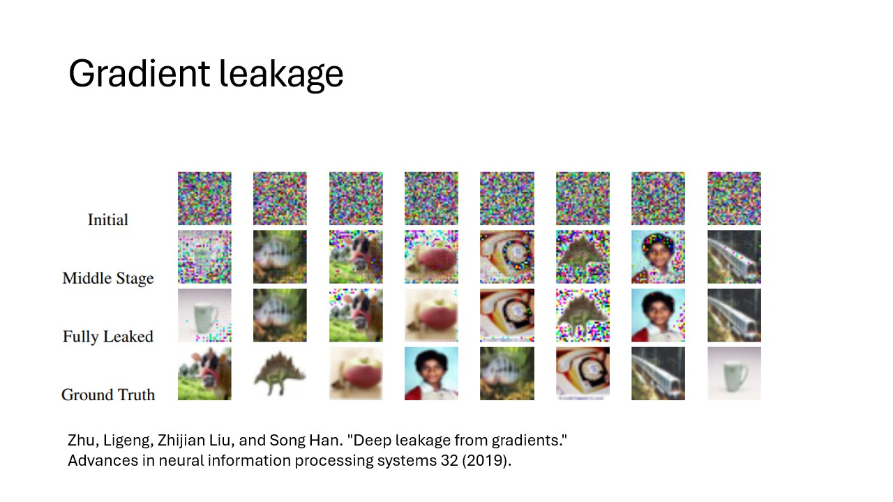
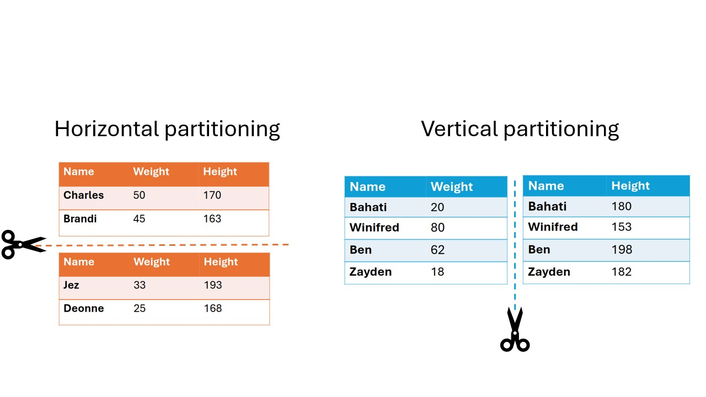

:::::::::::::::::::::::::::::::::::::: questions

- What techniques exist for analyzing data while protecting privacy?
- What are issues with only using data anonymization or pseudonymization?
- What are the building blocks to create a privacy enhancing analysis?
- What what are some non-technical challenges for performing privacy enhancing analysis?

::::::::::::::::::::::::::::::::::::::::::::::::

::::::::::::::::::::::::::::::::::::: objectives

- Understand PET, FL, MPC, homomorphic encryption, differential privacy
- Understand how different PET techniques relate
- Understand scenarios where PET could be applied
- Understand horizontal vs vertical partitioning
- Decompose a simple analysis in a federated way
- Understand that there is paperwork to be done (DPIA etc.)

::::::::::::::::::::::::::::::::::::::::::::::::

## Problem statement

The amount of data being generated nowadays is absolutely mind-boggling. This data can be a valuable
resource for researchers. However, personal data should be handled with great care and
responsibility
because of its sensitive nature. This is why there are privacy regulations in place like
[GDPR](https://gdpr-info.eu/) to prohibit easy access to this wealth of data.

However, often researchers are not interested in the personal records that make up the data, but
rather
in the _insights_ derived from it. This raises an intriguing question: Can we unlock these valuable
insights in a manner that upholds and respects privacy standards?

In classic data analysis, all data is copied over into a single place. This makes it very easy to
use
conventional data analysis software and tools to gain insights.

{alt='Two tables
with data are moved to a central location'}

Unfortunately this way of working does not respect the privacy of the people contained within the
dataset. All their personal details end up at another party.

::::::::::::::::::::::::::::::::::::: challenge

## Other problems with copying data

Discuss in groups what other issues you see with handling the data by copying everything into one
central place.

:::::::::::::::: solution

You might think of multiple issues. Some examples:

- The original data owner loses control of the data
- Results in multiple versions of the data
- What to do when the data needs to be updated?
- If there was consent in the first place, how can you retract consent?

:::::::::::::::::::::::::
:::::::::::::::::::::::::::::::::::::::::::::::

In this lesson, we will discuss various privacy-enhancing technologies (PET) that can be used to
analyze data in a privacy-preserving manner, and what the risks associated with different
technologies are.

## Data anonymization and pseudonymization

The first step in the process is often _data anonymization_. Personal identifiable information
will in this case be removed so that individuals stay anonymous. Data _pseudonimization_ is a
similar process, but in this case, the records will be assigned an id that will make it
possible to link individuals across datasets.

{alt='Names are censored before the datasets
are sent to a central place'}

While data anonymization and pseudonymization are often a good first step, there is no guarantee
that the data will never be reidentified. A famous example of reidentification is the story of the
[Netflix prize](https://en.wikipedia.org/wiki/Netflix_Prize). The Netflix prize was an open
competition to build the best recommender system to predict user ratings for films based on previous
ratings. The data was anonymized, but in 2007 two researchers from The University of Texas at Austin
were able to identify a large number of users by matching the dataset with film ratings on the
Internet Movie Database (IMDB).

## Federated data analysis

There are different ways in which privacy risks can be mitigated. For example, a well-known technique
is to send the data to a trusted third party (TTP). The data can then be analyzed at that location in
a traditional way. However, there are issues with this technique. When the data is copied to the TTP,
the original owner loses control over it. Another issue with it is that this technique results in a
single point of failure. If the security at the TTP is breached, all the data it handled could be exposed.

In this course we will focus on federated analysis. In a federated setting, the data with the data owner,
 who keeps full control over it. In this case, it is not the data that travels, but the analysis itself. 
 The system sends a query or instruction to the data and only the results will get back to the user.
The results are often akin to a form of _aggregation_ of the data. This can be in the shape of
traditional statistics like the mean, or it can be more intricate like a machine learning model.

Aggregating the data does not ensure complete protection of person-level information, but it
certainly makes it less likely that this will happen. It is usually the case that the larger 
the dataset, the lower the risk of data leakage. For instance, if you would like to take the mean of
all records that fit a certain requirement, like age > 90, and there happens to be only one
records that fits the requirement, the aggregation will be equal to the one matching individual record.

## Federated learning

The term federated learning was introduced in 2016 by researchers at Google
[(McMahan et al.)](https://doi.org/10.48550/arXiv.1602.05629) and refers to a "loose federation of
participating devices (which we refer to as clients) which are coordinated by a central server.” In
traditional federated learning, the clients train machine learning models, and only the updates of
the models are sent back to the central server. The central server combines the updates from all the
individual clients into one final machine learning model.

There are caveats to using this type of data analysis though. Although the data transmitted from the
clients to the server are an aggregation of the raw data, researchers have found a way to use this
data to reconstruct the original data. This vulnerability is called _gradient leakage_.

## Secure Multiparty Computation

There are different solutions to prevent the reconstruction of raw data. One solution is to make
sure that no party other than the data owner is actually able to see the intermediate data. One
branch
of techniques that can be used for this is Secure Multiparty Computation (MPC). With MPC,
computations are performed collaboratively by multiple parties. Data is encrypted in such a way that
other parties cannot see the original values, but values of multiple parties can still be combined (
e.g. added or multiplied).
A classic technique from the field of MPC is secret sharing. With this technique data is encrypted,
after which pieces of the encryption are sent to the other parties. No single party will be able to
reconstruct the original value. Only when a certain minimum of parties work together (n-1 in many cases) 
the original value can be retrieved.

When combining multiple values using secret sharing, this will result in the parties owning new
puzzle pieces that when put together will reveal the result of the computation.

::: callout

### Secret sharing, an example

Mees, Sara and Noor want to know how much they weigh in total.
Mees weighs 43 kg, Sara weighs 39, Noor weighs 45.
All three they think of 2 random numbers $r_1$ and $r_2$ so that $weight = r_1 + r_2 + x$. Finally
they compute $x$ by $x=weight - r_1 - r_2$

After computing the secret shares, they distribute these "cryptographical puzzle pieces" among
their peers.

|                 | Mees receives | Sara receives | Noor receives | Sum |
| --------------- | ------------- | ------------- | ------------- | --- |
| Mees generates: | -11           | 50            | 4             | 43  |
| Sara generates: | -12           | 17            | 34            | 39  |
| Noor generates: | 19            | -38           | 64            | 45  |

They sum their shares:

|      |     |
| ---- | --- |
| Mees | -4  |
| Sara | 29  |
| Noor | 102 |

They add their sums together: -4 + 29 + 102 = 127
In this way, they have aggregated their data without sharing their individual data with anyone else.

:::

::::::::::::::::::::::::::::::::::::: challenge
## Oh no! A hacker!
A hacker manages to get access to Mees' computer that contains the secret shares he received. Will
the secrecy of the three weights still be preserved?

:::::: solution
When receiving a sum from a set of 3 individuals, every record makes up roughly 30% of the final answer.
That is a big contribution. It can be quite easy to reconstruct the individual records, for example
by crossreferencing with other datasets. Also, if you are able to get your hands on 2 of the datapoints,
you will be able to fully reconstruct the third one.

Trust is another factor here. If the different parties (Mees, Sara and Noor) have a high level of trust
in eachother not to share their data, the risk level is lower than when the parties are known to occasionally
leak their data, or don't have proper security set in place.

::::::
::::::

::::::::::::::::::::::::::::::::::::: challenge
## Aggregation preserves privacy?
Consider the dataset with the 3 childrens weights again. The only unencrypted data everybody receives,
is the result. Consider the situation where Sara knows Mees very well, and might know approximately how
much he weighs. Do you think the privacy of the three individuals is properly preserved?

:::::: solution
When receiving a sum from a set of 3 individuals, every record makes up roughly 30% of the final answer.
That is a big contribution. It can be quite easy to reconstruct the individual records, for example
by crossreferencing with other datasets. Also, if you are able to get your hands on 2 of the datapoints,
you will be able to fully reconstruct the third one.

Usually there are guard rails in place when performing PET analysis to reject situations where there are 
very few datapoints, because the original data is too easy to reconstruct. 

Trust is another factor here. If the different parties (Mees, Sara and Noor) have a high level of trust
in eachother not to share their data, the risk level is lower than when the parties are known to occasionally
leak their data, or don't have proper security set in place.

::::::
::::::

## Differential privacy

As mentioned before, aggregation of data will not always prevent leaks of sensitive information.
Consider the example of Mees, Sara and Noor. We know their total weight is 127 kg. If Sara and Noor
get together and subtract their weights off of the total, they will be able to infer how much Mees
weighs.

An aggregation is fully differentially private when someone cannot infer whether a particular individual
was used in the computation. In the field of differential privacy there are different techniques
for adapting analyses to be more differentially private. Often these techniques involve adding
noise to either the raw data or the result of the analysis. This makes the result less precise, 
but with the added benefit that it will be more difficult to infer the original data.

The figure below shows a differential privacy technique where a random subset of the data is replaced
with random values. This gives an individual plausible deniability regarding whether they were part of 
the original dataset. Their data might have been used, or it might have been replaced with noise.

## Blocks upon blocks

The previously mentioned techniques are not used in isolation, but are usually stacked on top of
eachother to mitigate the privacy risks that are relevant within the usecase.
Typically, the process begins by anonymizing or pseudonymizing the data. With vantage6, the data is
then placed in a federated setting. Then, the data is analyzed using federated learning,
which may also include, for instance, MPC protocols to further safeguard data privacy. Additionally,
noise may be added to the raw data as well before it is analyzed, using techniques from differential
privacy.

## Data partitioning

Data sharing challenges come in many different shapes and sizes, but in the end, the goal of the
researchers is often to analyze data _as if_ it were available in one big table in one place.
There are 2 main ways in which the dataset can be separated over different sources: **horizontal**
and **vertical** partioning.

In horizontal partitioning, this giant table has been snipped in pieces
by making horizontal cuts. The result is that information of an individual record will stay in one
place, but the records themselves have been scattered around in different locations. A
common example of horizontal partitioning is when different hospitals have the same
data on different patients.

In vertical partitioning, the cuts have been made vertically. Columns have now been divided over
different locations. For example, this would be the case if a hospital has data on a set of patients
and the GP has different information for the same set of patients.
This type of partitioning is usually more challenging because often a way needs
to be found to link identities across datasources. Vertical partitioning requires different types
of privacy enhancing algorithms than horizontal partitioning.

Data can even be horizontally and vertically partitioned at the same time. In these cases, it may be
necessary to combine multiple techniques. For example, you might want to combine census data with
medical records from hospitals. This is vertically partitioned because the census and medical features
are stored in different places. On top of that, you might want to combine multiple hospitals, that
all store their records separately. Since the medical records are physically separated as well, it is
horizontally partitioned.

## Technology doesn't solve everything

You have now learned about various technologies for analyzing data while preserving privacy of
individuals. However, it should be emphasized that these technologies do not solve all your data
sharing problems. Rather, they are only a small piece of the puzzle. In research projects involving
privacy enhancing technologies, a lot of work goes into complying with regulations and building
trust.

Since these projects have a risk of affecting the privacy of individuals, a Data Protection Impact
Assessment (DPIA) is usually required. This is a process that will help identify and minimize privacy risks of a
project and is required by the GDPR. There is already a [DPIA available for vantage6](https://vantage6.ai/documents/28/DPIA_vantage6_version2023.pdf)

Apart from procedures required by GDPR there might be other regulations in place enforced by the
owners of the data (e.g. hospitals). For healthcare specifically there will be the 
[European Health Data Space (EHDS)](https://health.ec.europa.eu/ehealth-digital-health-and-care/european-health-data-space_en).
 EHDS builds upon the GDPR and ensures the exchange and reuse of healthcare data in a safe and secure way.

The specific situation of a project can affect the way in which
the data is allowed to be processed. Some privacy enhancing technologies might be allowed in one
project but prohibited in another. It is always important to stay transparent about privacy risks
of the technologies you intend to use.

Another factor in performing PET analysis is *data harmonization*. All parties need to make sure that
their data is in the right shape to be combined. For instance, if you have two datasets where one
stores the height of patients in a column "height" in centimeters, and another dataset where it is stored
in meters in the column "patient_height" you cannot perform your analysis. You will need to make sure
all datasets follow the same standards and schemas in order to process them together. There are a
couple of datastandards out there to help you with that, such as [OMOP CDM](https://www.ohdsi.org/data-standardization/) 
or [FHIR](https://hl7.org/fhir/) together with [SNOMED-CT](https://www.snomed.org/).

In conclusion, PETs will help you to extract valuable insights from sensitive data, but they are only one aspect
of the process. It is also important to consider other factors such as regulations and data preprocessing.

## Up next
In the upcoming chapters we will explore how privacy-enhancing technologies are integrated into the vantage6 software framework. First, we will introduce the core concepts of vantage6 through its user interface (UI) and demonstrate how to run a privacy-enhancing algorithm within it. We will also cover how to manage collaborations, one of vantage6's key distinguishing features.

In the second part of the workshop, we will shift focus to interacting with vantage6 using Python, taking the place of the UI. We will also delve into creating a federated algorithm using the platform's algorithm tools.

::::::::::::::::::::::::::::::::::::: keypoints

- Privacy enhancing analysis can derive insights from data without seeing individual records.
- Privacy enhancing analysis usually starts with the anonymization or pseudonymization of the data.
- In federated data analysis the analysis moves to the data, while in classic analysis the data moves around.
- In secure multiparty computation, computations are performed collaboratively without any one party being able to see all the raw data.
- Techniques from differential privacy add noise to the data to make it harder to reconstruct the original records from an aggregation.
- Privacy enhancing analyses usually stack multiple techniques on top of each other to provide multiple layers of protection.
- Horizontal partitioning means the records are split, while in vertical partitioning the features are split.
- Technology is only one part of the story, when doing research on privacy sensitive data. 
::::::::::::::::::::::::::::::::::::::::::::::::
