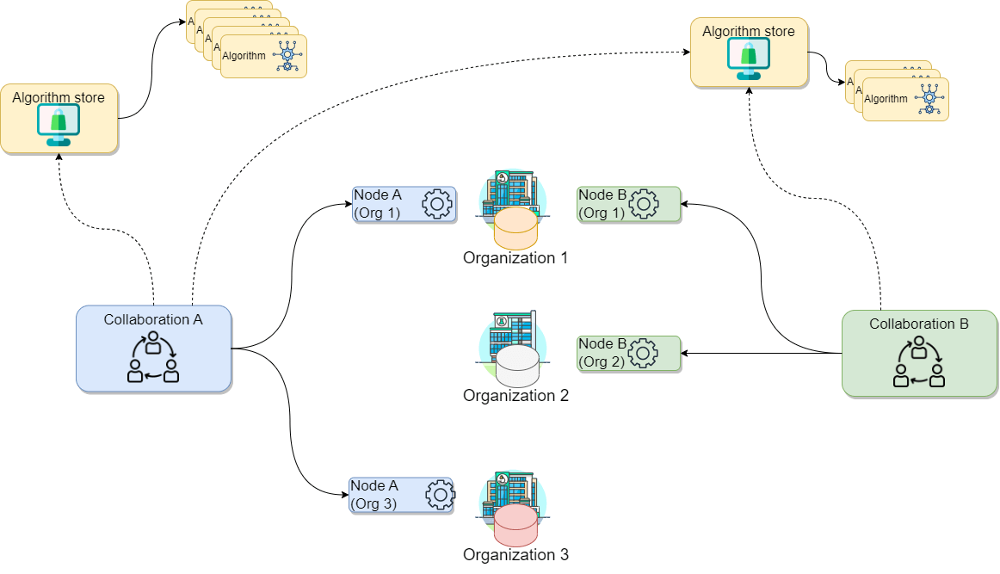
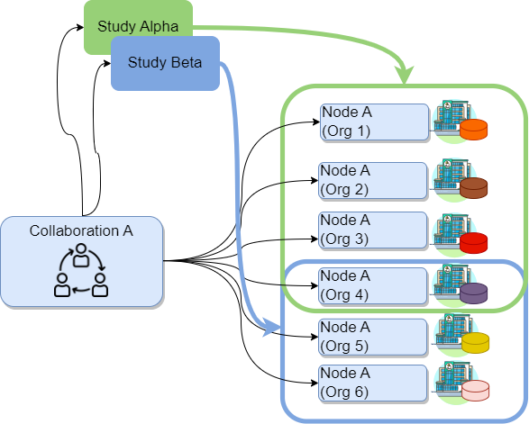
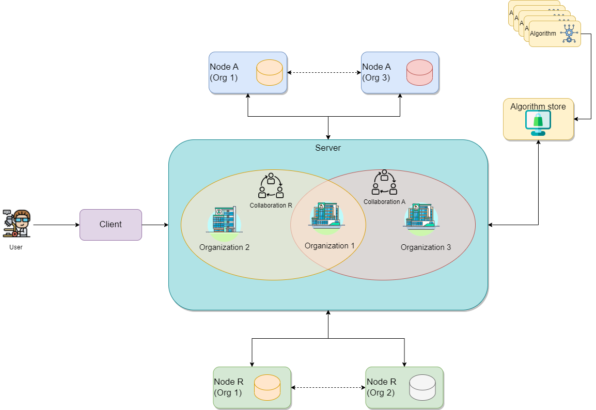
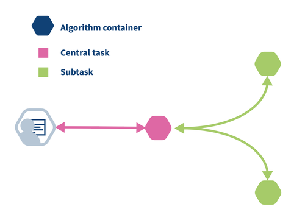
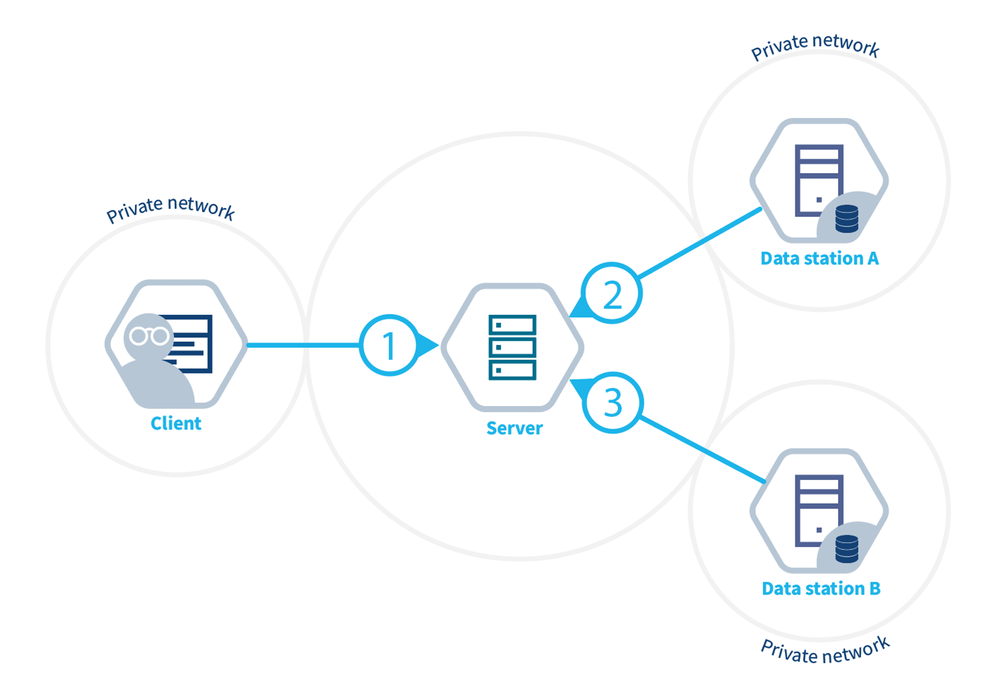
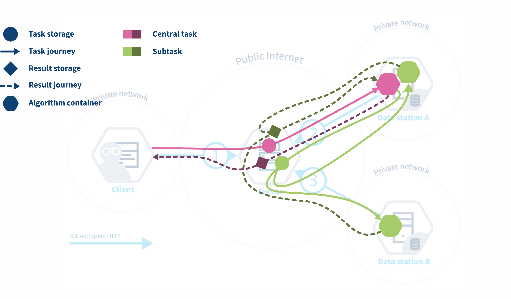

::: questions

- Why should I use vantage6?
- How does vantage6 work?
- How do federated algorithms run in vantage6?
- What will be available in vantage6 in the future?

:::

::: objectives

- List the high-level infrastructure components of vantage6 (server, client, node)
- Understand the added value of vantage6
- Understand that there are different actors in the vantage6 network
- Understand that the vantage6 server does not run algorithms
- Explain how a simple analysis runs on vantage6
- Understand the future of vantage6 (policies, etc.)

:::

# Why choose vantage6

vantage6 is a platform to execute privacy enhancing techniques (PETs). Several alternative platforms for PETs are available, but vantage6 is unique as it provides:

- Open source and free to use.
- Container orchestration for privacy enhancing techniques.
- Easily extensible to different types of data sources.
- Algorithms can be developed in any language.
- Other applications can connect to vantage6 using the API.
- Managing and enforcing collaboration policies
- Minimal network requirements at data stations

# Project administration in vantage6
vantage6 encompasses a project administration system that allows the user to manage permissions and access to the resources, while assuring the protection of the data. The fundamental concepts of the administration system are defined as follows:

- An **Organization** is a group of users that share a common goal or interest (e.g., a consortium, an institute, etc.). 
- A **Collaboration** involves one or more **organizations** working together towards a shared objective. 
- A **Node** is a vantage6 component with access to the **organization** data, which is capable of executes algorithms on it. It represents the organization's contributions to the network.
- A **Task** is a request for the execution of a given analysis **algorithm** on one or more **organizations** within a **collaboration**. These execution requests are handled by the corresponding organizations' **nodes**.
- A **user** is a person that belongs to one **organization** who can create **tasks** for one or more **organizations** within a **collaboration**.
- An **algorithm** is a computational model or process -that adhere to the vantage6 framework-, which can be securely distributed to **nodes** for execution on the corresponding organization's data.
- An **algorithm store** is a centralized platform for managing pre-registered **algorithms**. This serves as an alternative to using algorithms from unknown authors or those lacking transparency regarding their development process and status.

The diagram below illustrates a collaboration between two organizations. In this scenario, users from `Organization 1` and `Organization 3` — with the appropriate credentials — can request the execution of **tasks** within *Collaboration A*. In this case, a user from `Organization 1` might request the execution of an **algorithm** (previously registered in an **algorithm store** trusted by the collaboration) across all participating organization nodes. In response, each node from the involved organizations executes the **algorithm** on its local data. The resulting (aggregated) data is then sent back to the server, where it can be accessed by the requesting user.
To enhance the security of the communication, messages between organizations can be encrypted. In this case, an organization can have a public key that the other collaborating organizations have to use in order to exchange messages.

The following diagram expand the previous scenario further: what if `Organization 1` needs to participate on an additional **collaboration** with another **organization** (e.g., `Organization 2`)? In this case, `Organization 1` will have two running nodes, one for each collaboration. Moreover, as also depicted on the diagram below, each **collaboration** can make use of one or more **algorithm stores**:

Finally, the concept of **study** is an important one when using vantage6 for data analysis. A **study** represents a subset of organizations within a given collaboration that are engaged in a specific research question. By setting up studies, you can more efficiently assign tasks to a specific group of organizations within a collaboration and better manage the results of these analyses. 

For example, consider the `Collaboration W` below, which includes six organizations. This collaboration might involve two distinct research questions: one that requires data from organizations 1, 2, 3, and 4, and another that focuses on data from organizations 4, 5, and 6. By establishing `Study Alpha` and `Study Beta`, you, as a researcher, can target your data analysis tasks in three different ways: you can address the entire `Collaboration W` (including nodes `A` to `F`), focus on `Study Alpha` (nodes `A` to `D`), or concentrate on `Study Beta` (nodes `D` to `F`).

::::::::::::::::::::::::::::::::::::: challenge

## Mapping vantage6 to "real life"

Let's consider a scenario where you, on behalf of your research institute, want to conduct a new study on a particular illness across three major academic hospitals in the Netherlands: VUmc in Amsterdam, Maastricht UMC+, and UMC Utrecht, as these have valuable data related to the illness. Consider the following:

- Your research institute has an existing collaboration (with a different purpose, not related with yours) with UMC Utrecht and UMC Groningen. Hence, there is a vantage6 node already running on your institution for the said collaboration.
- You will be conducting this study with a colleague from your institute named Daphne. Both of you are already registered on the organization but without access to the existing collaborations.

How would the concepts described above map to your potential use case?

1. Which organizations will you need to add to your collaboration?
2. How many new nodes would you need to set up and on which organizations?
3. How many users would be created?

::::::::::::::::::::::::::::::::::::::::::::::::

:::::::::::::::::::::::: solution

## Solution

1. In this case the organizations would be the academic hospitals as well as your own organization: VUmc, Maastricht UMC+, UMC Utrecht *and* your research institute. Note that UMC Utrecht must be added to the new collaboration despite being already part of an existing one.
2. One node for every academic hospital, so 3. Note that UMC Utrecht needs a new node despite already having one, as the existing one is for a different collaboration.
3. There is no need to create new users, as these are already registered on the organization. Note that the users are linked only to the organization, not to the nodes.

:::::::::::::::::::::::::::::::::

# The vantage6 infrastructure

Now that we have an overview of how vantage6 manages the project resources and how it can be used to setup the analysis framework, we can see how vantage6 works on a technical level and how the infrastructure maps the aforementioned concepts.
In vantage6, a user can pose a question through a **client** to the vantage6 **server**. Each organization with sensitive data contributes one **node** to the network. 
The nodes collect the computation request from the server and fetches the **algorithm** from the **algorithm store** to answer it. When the algorithm completes, the node sends the aggregated results back to the server.

On a technical level, vantage6 may be seen as a container orchestration tool for privacy preserving analyses. It deploys a network of containerized applications that together ensure insights can be exchanged without sharing record-level data.

Let's explain in some more detail what these network actors are responsible for, and which subcomponents they contain.

### Server

The vantage6 **server** acts as communication hub between clients and nodes. The [server](https://docs.vantage6.ai/en/main/server/index.html) tracks the status of the computation requests and handles administrative functions such as authentication and authorization. It consists of multiple applications:

- **Vantage6 server**: Contains the users, organizations, collaborations, tasks and their results. It handles authentication and authorization to the system and acts as the communication hub for clients and nodes.

- **Docker registry**: Contains algorithms stored in container images which can be used by clients to request a computation. The node will retrieve the algorithm from this registry and execute it. It is possible to use public registries for this purpose like [Docker hub](https://hub.docker.com/) or [Github Containers](https://ghcr.io). However it is also possible to host your own registry, for example a [Harbor](https://goharbor.io/) instance.

### Data Station

The data station hosts the local data and the [node](https://docs.vantage6.ai/en/main/node/index.html) (vantage6-node). The **Vantage6 node** is responsible for executing the algorithms on the local data. It protects the data by allowing only specified algorithms to be executed after verifying their origin. The node is responsible for picking up the task and running them in parallel, executing the algorithm and sending the results back to the server. For more details see the [technical documentation of the node](https://docs.vantage6.ai/en/main/node/index.html).

### Client

A user or application who interacts with the vantage6-server. They create tasks, retrieve their results, or manage entities at the server (i.e. creating or editing users, organizations and collaborations).

The vantage6 server is an API, which means that there are many ways to interact with it programmatically. There are however a number of applications available that make is easier for users to interact with the vantage6 server:

- **User interface**: The [user interface](https://docs.vantage6.ai/en/main/user/ui.html) is a web application (hosted at the server) that allows users to interact with the server. It is used to create and manage organizations, collaborations, users, tasks and algorithms. It also allows users to view and download the results of tasks. Use of the user interface recommended for ease of use.

- **Python client**: The [vantage6 python client](https://docs.vantage6.ai/en/main/user/pyclient.html) <python-client> is a Python package that allows users to interact with the server from a Python environment. This is especially usefull for data scientists who want to integrate vantage6 into their workflow.

### Algorithm store

While a vantage6-supported research infrastructure offers a strong defense against many data privacy risks, there remains one crucial security aspect that falls outside the platform's scope: the validation of the code that will run on this infrastructure. For instance, the administrators of the nodes running within each organization are responsible for defining which algorithms (i.e., [which container images](https://docs.vantage6.ai/en/main/node/configure.html#all-configuration-options)) will be allowed for execution on the respective collaborations. As this is a critical and complex task that entails activities like code analysis and verification, working with algorithms from trusted sources is the primary line of defense against potential threats.

Vantage6's algorithm store is a repository for trusted algorithms within a certain project that aims to enhance trustworthiness by offering a centralized platform for managing pre-registered algorithms. This serves as an alternative to using algorithms from unknown authors or those lacking transparency regarding their development process and status. The algorithm store currently allows researchers to explore which algorithms are available and how to run them. This, streamlines task execution requests within collaborations. Also, the algorithm store integrates additional information to the algorithm metadata such who developed and reviewed the algorithm. Only after complying with the review policies of a store, a new algorithm will be published in the store.

## How algorithms run in vantage6

Federated algorithms can be split in a **federated** and a **central** part:

- **Central**: The central part of the algorithm is responsible for orchestration and aggregation of the partial results.

- **Federated**: The partial tasks are executing computations on the local privacy sensitive data.

Now, let’s see what typically happens if a task is created in vantage6:

- The user creates a task for the central part of the algorithm. This is registered at the server.
- The task registration leads to the creation of a central algorithm container on one of the nodes.
- The central algorithm creates subtasks for the federated parts of the algorithm, which again are registered at the server.
- All nodes for which the subtask is intended start their work by executing the federated part of the algorithm.
- When finished, the nodes send the results back to the server
- Each node's results are picked up by the central algorithm. The central algorithm then computes the final result and sends it to the server
- The user retrieves the result from the server.

::: callout

## vantage6-server vs central part of an algorithm

It is easy to confuse the vantage6 server with the central part of the algorithm: the server is the central part of the infrastructure but not the place where the central part of the algorithm is executed. The central part is actually executed at one of the nodes, because it gives more flexibility: for instance, an algorithm may need heavy compute resources to do the aggregation, and it is better to do this at a node that has these resources rather than having to upgrade the server whenever a new algorithm needs more resources.
:::
::: challenge

Two centers $A$ and $B$ have the following data regarding the age of a set of patients:

$a = [34, 42, 28, 49]$

$b = [51, 23, 44]$

Each center has a data station and we want to compute the overall average age of the patients.

Given that we that the central average can be computed by summing up all the values and dividing the sum by the number of values, using the following equation:

$\overline{x} =\dfrac{1}n \sum_{i=1}^{n} x_i = \dfrac{34+42+28+49+51+23+44}7$

To make it ready for a federate computation, the equation can be rewritten as the sum of the elements of A plus the sum of the elements of B, divided by the number of elements of A plus the number of elements of B:

$\overline{x} =\dfrac{1}{n_a+n_b} (\sum_{i=1}^{n_a} a_i+\sum_{i=1}^{n_b} b_i) = \dfrac{1}{4+3}[(34+42+28+49)+(51+23+44)]$

Can you determine which part of the infrastructure will execute each part of the computation, and which is the result returned by the different parts?

::: solution

The Server starts the central task on one of the two nodes (e.g. Data station A).

The node A starts two subtasks, one per node. Node A will run the following computation:

$S_a =\sum_{i=1}^{n_a} a_i = (34+42+28+49)$

and it will return the following results to the central task:

$S_a=153$

$n_a=4$

Node B will run the following computation:

$S_b =\sum_{i=1}^{n_b} a_i = (51+23+44)$

and it will return the following results to the central task:

$S_b=118$

$n_b=3$

The central task receives $S_a$ and $n_a$ from node A and $S_b$ and $n_b$ from node B, and will run the following computation:

$\overline{x} =\dfrac{S_a+S_b}{n_a+n_b}=\dfrac{153+118}{4+3}=38.71$

:::

:::

# Future developments of vantage6

Back in 2018 when the development of vantage6 started, the focus was on federated learning. Since then, vantage6 has been extended to support different types of data sources, different types of algorithms and improved its user experience. Privacy Enhancing Technologies (PET) are a rapidly evolving field. To keep up with the latest developments, the vantage6 platform is designed to be flexible and to adapt to new developments in the field.

From the development team we are working towards making vantage6 the PETOps platform for all your (distributed) analysis needs.

[Image of the PETOps cycle]

We identified a number of areas where we want to improve and extend vantage6 in order to achieve this goal:

## Policies

Currently, vantage6 lets you set several policies, such as the organizations that are allowed to participate in a collaboration, the algorithms that are allowed to run on the nodes, and the data that is allowed to be used in a collaboration. We want to extend this to a more generic policy framework in which any aspect of the vantage6 platform can be controlled by policies. This will maximize the flexibility of the platform and make it easier to adapt to new use cases.

For example, it would be possible:

- Define the version of vantage6 that is allowed to be used in a collaboration
- Which users is allowed to run a certain algorithm
- Which algorithms are allowed in a collaboration/study
- Define privacy guards at algorithm level

In order to avoid that policies need to be set manually at the nodes, we envision a distributed policy system (possibly using blockchain technology) in which policies are distributed to the nodes by the server.

## Model Repository

Currently, vantage6 is focused on privacy enhancing techniques. Some of these techniques result in a model that can be used to make predictions. We want to extend vantage6 with a model repository in which these models can be stored, shared and used. This will make it easier to reuse models and to compare the performance of different models.

## Build Services

Algorithms in vantage6 are shipped as container images. Currently, this image can be built by the user or some external process. We want to extend vantage6 with a build service that can build the container image for you. This will make it easier to develop and deploy algorithms in vantage6 but more importantly, it will enhance the security of the platform as they are build in a controlled environment.

::: keypoints
- vantage6 is an open source platform to execute PET analysis.
- A client is used to interact with the system.
- A vantage6 server orchestrates the execution of algorithms.
- The nodes contain the data and execute the computation.
- The algorithms in vantage6 have a federated part, running on local data, and a central part, aggregating the results.
:::
