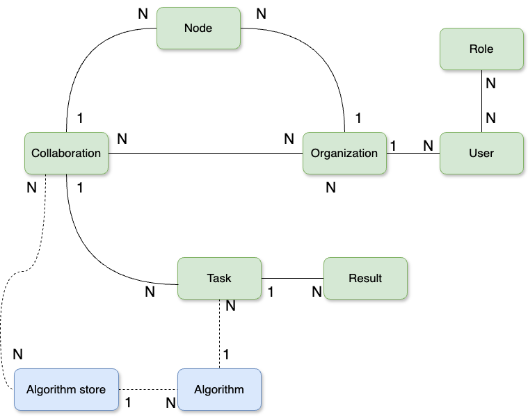
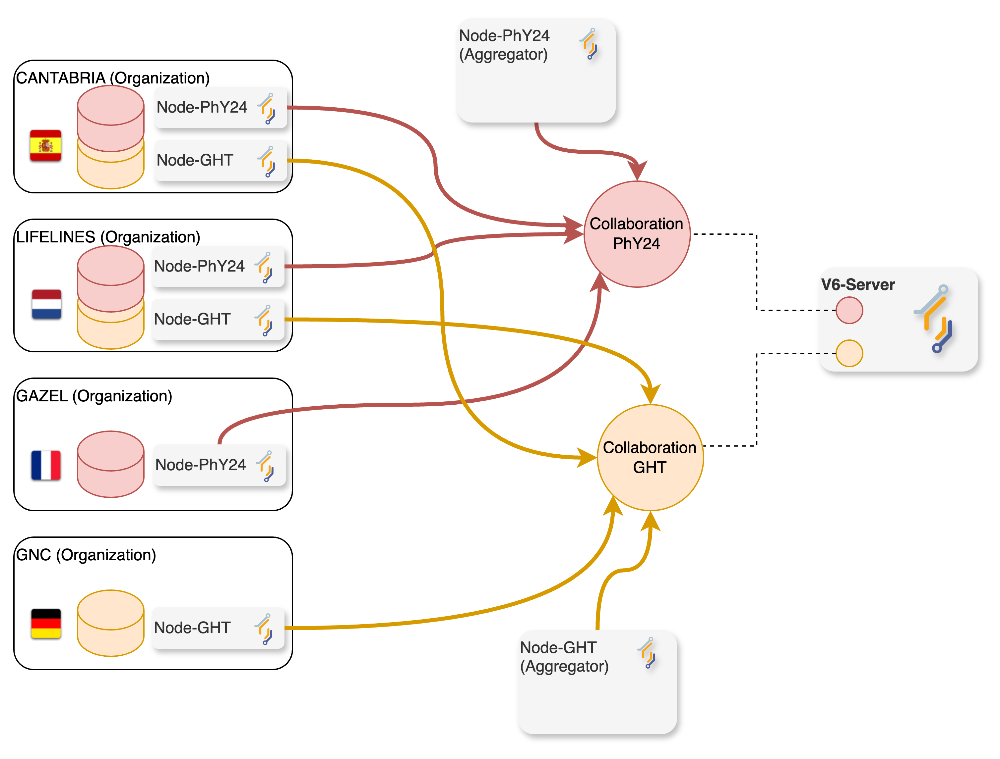
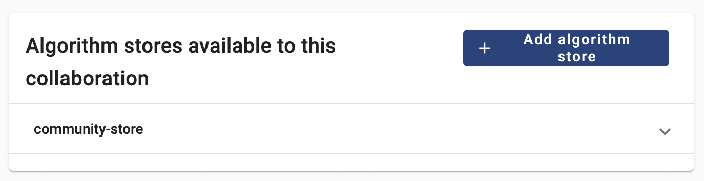
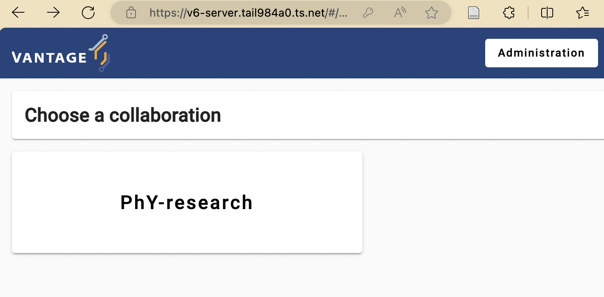
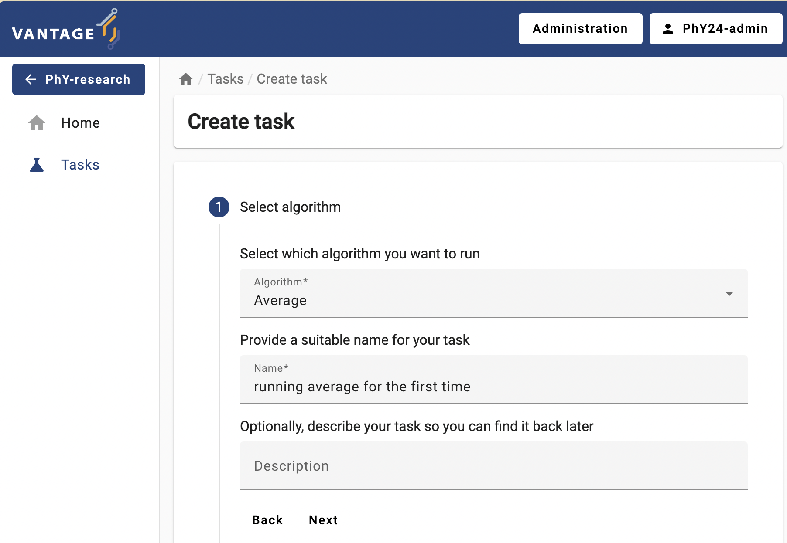
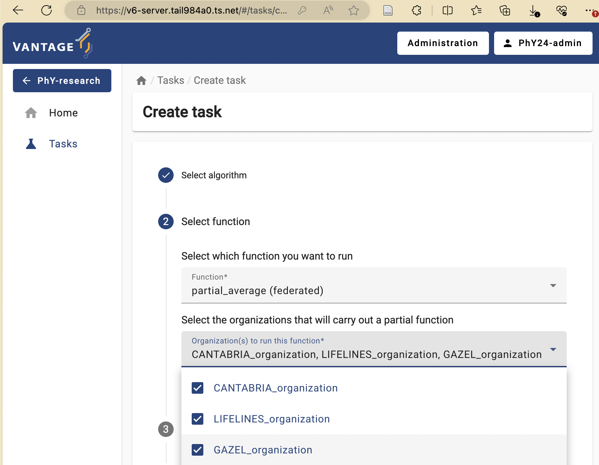
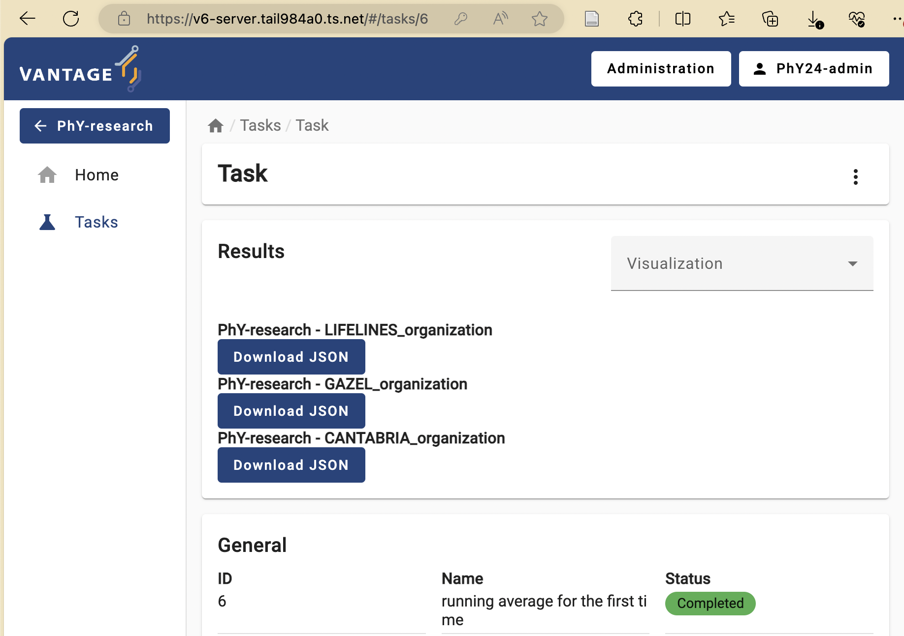

:::::::::::::::::::::::::::::::::::::: questions

- How does a vantage6 collaboration work?
- How to check the status of a given collaboration within vantage6?
- How to link an algorithm store to a given collaboration?
- How to run a task through vantage6's UI?

:::::::::::::::::::::::::::::::::::::::::::::::::

::::::::::::::::::::::::::::::::::::: objectives

- Explore specific data analysis scenarios that further illustrate the concept of collaboration
- Understand the concept of 'algorithm trustworthiness' in the context of a vantage6 collaboration
- Understand vantagee6's algorithm-store current and envisioned features
- Understand the UI-based approach for performing a data analysis through the given scenarios

::::::::::::::::::::::::::::::::::::::::::::::::

## Vantage6 user interface basics

To navigate vantage6's UI seamlessly, it's essential to grasp the platform's fundamental concepts and their interconnections, as the UI design reflects these relationships. The following is a simplified model of vantage6 concepts, where a `1-n` relationship means that the entity on the left side of the relationship is related to one or more entities on the right side. For instance, a **collaboration** involves one or more **nodes**, but each **node** can only be linked to exactly one **collaboration**. An `n-n` relationship is a many-to-many relationship: for instance, a **collaboration** can involve multiple **organizations**, and at the same time, each **organization** can participate in multiple **collaborations**.

Given the above, the following are the most important concepts for this lesson:

- **Organization**: a group of users that share a common goal or interest (e.g., a consortium, an institute, etc.).

  - An organization has zero or more **users** who can perform certain actions.
  - An organization can have multiple **nodes**, one for each **collaboration** it is part of.

- **Collaboration**: a collection of one or more **organizations** working together towards a shared objective.

  - In a specific **collaboration**, each participating **organization** needs one **node** to compute **tasks**; In another **collaboration**, the same **organization** must have a separate **node** for this **collaboration**.

- **Node**: the component with access to the **organization** data, which also executes algorithms on it. It represents the organization's contributions to the network.

- **Task**: a request, created by **users** for the execution of a given **algorithm** on one or more organizations within a collaboration. These execution requests are handled by the corresponding organizations' **node**.

- **User**: a person who can perform certain actions in vantage6.

  - A user can only belong to one **organization**.
  - A user can have multiple **roles** and can be assigned with extra permissions not covered by the roles.
  - A user can create **tasks** for one or more **organizations** within a **collaboration**.

- **Role**: a collection of rules that define the permissions of a **user** (which will be further explored in [Chapter 4](./chap4_manage_via_ui.md)).
- **Result**: the output generated by the execution of an **algorithm** as part of a **task**.
- **Algorithm**: computational models or processes that are executed on data. Compatible algorithms are those that adhere to the Vantage6 framework, enabling them to be securely distributed to **nodes** for execution.

::::::::::::::::::::::::::::::::::::: challenge

## Mapping vantage6 to "real life"
Let's imagine a usecase where you would like to study an illness accross
3 different academic hospitals in the Netherlands: VUmc, Maastricht UMC+, and UMC Utrecht.

You are going to study together with one other person in your group named Daphne.

How would these entities map to your potential usecase?

1. Which organizations would be part of the collaboration?
2. How many nodes would you run?
3. How many users would be created?

::::::::::::::::::::::::::::::::::::::::::::::::

:::::::::::::::::::::::: solution

## Solution

1. In this case the organizations would be the academic hospitals as well as your own organization: VUmc, Maastricht UMC+, UMC Utrecht *and* your organization.
2. One node for every academic hospital, so 3
3. There will be 2 users running tasks. Additionally there could be more users for administrating the collaboration.

:::::::::::::::::::::::::::::::::

### Where are these concepts in the UI?

After logging in to the vantage6 UI, you will see the start page.

There are some collaborations displayed on the start page. Clicking one of the collaborations will show the tasks of that collaboration.

The start page also contains a button `Administration` in the top right corner. Clicking on this button will redirect you to the administration page.

On the administration page, you can manage the entities of vantage6. The entities are divided into tabs: `Organizations`, `Collaborations`, `Roles`, `Users`, and `Nodes`. You can click on an entity to see more details or to edit the entity. We will get back to this later in more detail.

::::::::::::::::::::::::::::::::::::: challenge

## Get familiar with the vantage6 UI

Log in to the Vantage6 UI using the credentials below (the password will be given by the instructors). Once logged in, navigate to the administration page to familiarize yourself with the entities there. Then, try to update your email, first name, and last name, but do not change your username, as it will be needed for some of the follow-up challenges.

|  User     |  Roles        |
|-----------|---------------|
|PhY24-rs1  | Researcher    |

::::::::::::::::::::::::::::::::::::::::::::::::

:::::::::::::::::::::::: solution

## Solution

:::::::::::::::::::::::::::::::::

## From theory to practice: a hypothetical case study using vantage6 collaborations

As previously discussed, in vantage6 a collaboration refers to an agreement between two or more parties to participate in a study or to answer a research question together. This concept is central to the Privacy Enhancing Technologies (PETs) that vantage6 supports. Each party involved in a collaboration remains autonomous, meaning they retain control over their data and can decide how much of their data to contribute to the collaboration's global model and which algorithms are allowed for execution.

To illustrate this, let's analyze a hypothetical scenario: two international research projects relying on vantage6 technology on the same server:

- The first one, **PhY2024** (Prevalence of hypertension and its association with lifestyle), requires determining the average systolic and diastolic blood pressure levels of the population across France, Spain, and The Netherlands.
- The second, **GHT** (Global Health Trends), requires determining the Average BMI across The Netherlands, Spain, and Germany.

Although both projects are unrelated and independent from each other, the data from Spain and The Netherlands -required by both- is provided by the same large-scale cohort studies, namely CANTABRIA (Spain) and LIFELINES (The Netherlands). However, legal agreements dictate that each project is granted access solely to the data essential for its intended purposes (gaining access to the whole set of variables study increases risks of inference attacks). Data from the French and German population (for **PhY2024** and **GHT** studies), on the other hand, will be provided by the GAZEL and GNC prospective cohort studies.

Following vantage6's concepts, this scenario would involve two collaborations, one for each research project. As described in previous episodes, a vantage6 node is needed for each collaboration. Consequently, as illustrated in the diagram below, both CANTABRIA and LIFELINES organizations require two vantage6 data-node instances each. Since each data node defines its own rules for data access and algorithm usage, this ensures that analyses from various collaborations, even those involving shared organizations/datasets, will not conflict with one another.

### Algorithms trustworthiness in a federated setting

While a vantage6-supported research infrastructure like the one described above offers a strong defense against many data privacy risks, there remains one crucial security aspect that falls outside the platform's scope: the validation of the code that will run on this infrastructure. For instance, the administrators of the nodes running within each organization are responsible for defining which algorithms (i.e., [which container images](https://docs.vantage6.ai/en/main/node/configure.html#all-configuration-options)) will be allowed for execution on the respective collaborations. As this is a critical and complex task that entails activities like code analysis and verification, working with algorithms from trusted sources is the primary line of defense against potential threats.

Vantage6's algorithm store aims to enhance trustworthiness by offering a centralized platform for managing pre-registered algorithms. This serves as an alternative to using algorithms from unknown authors or those lacking transparency regarding their development process and status. The algorithm store currently allows researchers to explore which algorithms are available and how to run them. This, along with its integration with vantage6's UI, streamlines task execution requests within collaborations. Also, the algorithm store integrates additional information to the algorithm metadata such who developed and reviewed the algorithm. Only after complying with the review policies of a store, a new algorithmn will be published in the store.

### Running a PET (privacy-enhancing technology) analysis without programming!

In this episode, you will perform a PET analysis on an existing vantage6 collaboration (based on 'dummy' nodes) that resembles the two described above. For reference, the datasets of each organization can be seen here (TODO).

::::::::::::::::::::::::::::::::::::: challenge

## Challenge 2: understanding a simple federated algorithm

First, let's take a look at one of the federated algorithms -available on the vantage6's community store- that will be used in this episode: [a federated average](https://github.com/IKNL/v6-average-py/blob/master/v6-average-py/__init__.py).

Analyze the algorithm based on the code and its comments and answer the following questions:

- How are the `central_average` and `partial_average` functions related?
- Why does the `central_average` function, unlike `partial_average`, **not** get any data as an input?
- Analyze and discuss the potential outcomes if a Task to execute `central_average` is initiated within a collaboration where one of the nodes is offline.

::::::::::::::::::::::::::::::::::::::::::::::::

::::::::::::::::::::::::::::::::::::: challenge

## Challenge 3: exploring the status of existing collaborations configured on a vantage6 server

Below are the administrator credential of GHT and PhY24 collaborations (passwords will be given by the instructors).

| User        | Roles               | Collaboration |
| ----------- | ------------------- | ------------- |
| PhY24-admin | Collaboration Admin | PhY24         |
| GHT-admin   | Collaboration Admin | GHT           |

Using these credentials check the status of both collaborations. Given this and your algorithm analysis from Challenge #2 answer the following:

1. Which collaborations are ready for creating a Task for the **federated average** algorithm?
2. If one of the collaborations is not ready, which organization you would need to contact in order to make it ready for executing the algorithm too?

::::::::::::::::::::::::::::::::::::::::::::::::

:::::::::::::::::::::::: solution

## Solution steps

To check the status of the nodes of each collaboration:

1. Log in to each one with the given credentials
2. Click on 'Administration' on the top of the UI
3. select 'Collaborations' on the left panel, and then select the corresponding collaboration.
4. If there are 'offline' nodes, click on the 'Nodes' panel on the left and check when these were seen for the last time.

:::::::::::::::::::::::::::::::::

::::::::::::::::::::::::::::::::::::: challenge

## Challenge 4: adding an algorithm store to an organization

In order to execute the **average algorithm** on a given collaboration, considering the previous discussion on algorithm trustwortiness, you need to first register an algorithm store on it first. Use the credentials given for Challenge #4 to register the 'community store', which contains the said algorithm: `https://store.cotopaxi.vantage6.ai`

::::::::::::::::::::::::::::::::::::::::::::::::

:::::::::::::::::::::::: solution

## Solution steps

You will now link the 'community-store' to the collaboration whose nodes are ready for it.

1. Login into the organization using the corresponding credentials from above.
2. Click on 'Administration' on the top of the UI, select 'Collaborations' on the left panel, and then select the corresponding collaboration.
3. Click on '+ Add algorithm store'
4. Add the vantage6's community store. Use any descrption as name, and provide community store URL: `https://store.cotopaxi.vantage6.ai`
5. Make sure the store is now shown on the collaboration details:
   

:::::::::::::::::::::::::::::::::

::::::::::::::::::::::::::::::::::::: challenge

## Challenge 5: your first algorithm execution as a researcher

Now, you'll take on the role of the researcher within the collaboration for which you've just established the algorithm store. With this role, you will finally request the execution of the algorithm.

1. log in as a researcher using the corresponding credentials below:

   | User      | Roles      | Collaboration |
   | --------- | ---------- | ------------- |
   | PhY24-rs1 | Researcher | PhY24         |
   | GHT-rs1   | Researcher | GHT           |

2. Select the collaboration given on the front page, and select 'Tasks' from the panel on the left.
   

3. If you have set up everything correctly, the 'Average' algorithm should be now listed under the '_Select which algorithm you want to run_' dropdown menu. Select it, and provide a name and a description.

   

4. Now the UI will let you choose between the two functions you explored in Challenge #1. First, try to run the `partial_average` on all the nodes individually.

   

5. Select the 'default' database, choose any numerical column as a parameter, and then click on 'Submit'.

6. The task you just requested should be listed with a 'pending' status. Once finished, explore and download the provided results:
   

Based on these results, answer the following:

1. If you repeat the same exercise but with the `central_average` function (refer to Challenge #2 if needed), which organization nodes should you choose this time to actually calculate the overall (across all the datasets) average? Experiment with this and discuss the results with the instructors.

2. What would happen if you select an alpha-numerical column (e.g., 'participant_pseudo_id')? Do this experiment and explore the generated error logs. Discuss with the instructors how these logs can be used to diagnose any task execution issues.

::::::::::::::::::::::::::::::::::::::::::::::::
