:::::::::::::::::::::::::::::::::::::: questions

- How can I perform basic administrative activities on vantage6 using the web-based UI?
- How do I check the status of a specific collaboration or study in the vantage6 UI?
- How do I request a task through the vantage6 UI?

:::::::::::::::::::::::::::::::::::::::::::::::::

::::::::::::::::::::::::::::::::::::: objectives

- Explore specific data analysis scenarios that further illustrate the concepts introduced on episode 2. 
- Understand the UI-based workflow for performing a data analysis on the given scenarios.

::::::::::::::::::::::::::::::::::::::::::::::::

:::::::::: prereq

# Prerequisite
Make sure you completed the [Episode 2](./chap2_introduction_v6.md) where the concepts the UI is based on are introduced.

:::::::::::::::::

## Interacting with the v6 server

As described on [Episode 2](./chap2_introduction_v6.md), the vantage6 server is the central component responsible for managing the entire federated/multi-party computation infrastructure and facilitating communication between the various entities within the vantage6 platform. This means that any use case—such as creating a collaboration, adding an organization to a collaboration, starting a task with a specific algorithm, or retrieving task results—requires interaction with the server.  In this episode, we'll dive into a hands-on exploration of how the vantage6 web-based user interface enables this interaction for basic data analysis on  a pre-configured collaboration (in [Episode 4](./chap4_manage_via_ui.md) you will learn how to configure your own). In [Episode 5](./chap5_python_client.md), you will explore how to perform these administrative tasks programmatically using the server API -the same API that powers the web interface behind the scenes.

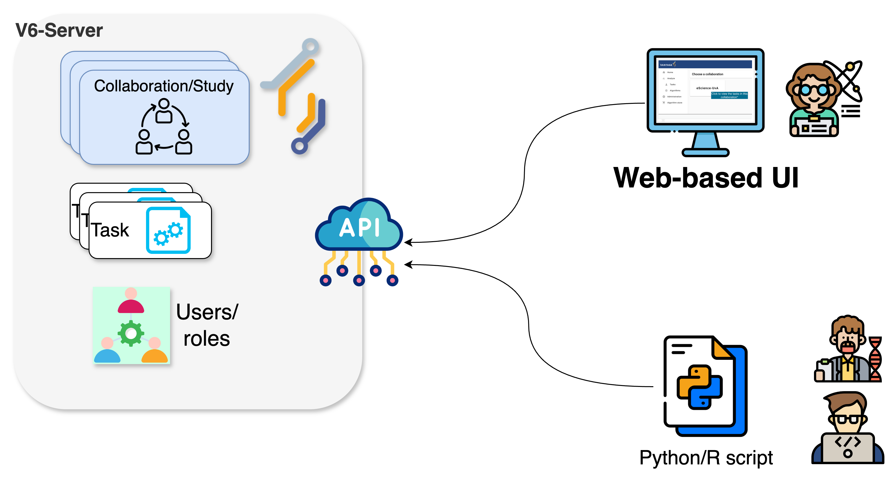

### Administration concepts in the UI

After logging into the vantage6 UI, you'll notice that most elements and the navigation between them align with the descriptions provided in [Chapter 2](./chap2_introduction_v6.md). For instance, on your start page you will see the collaborations your organization is part of. Clicking one of the collaborations will show the tasks of that collaboration.

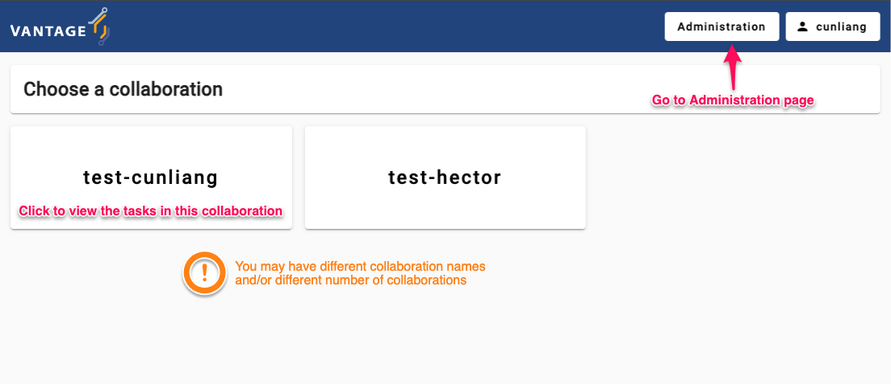

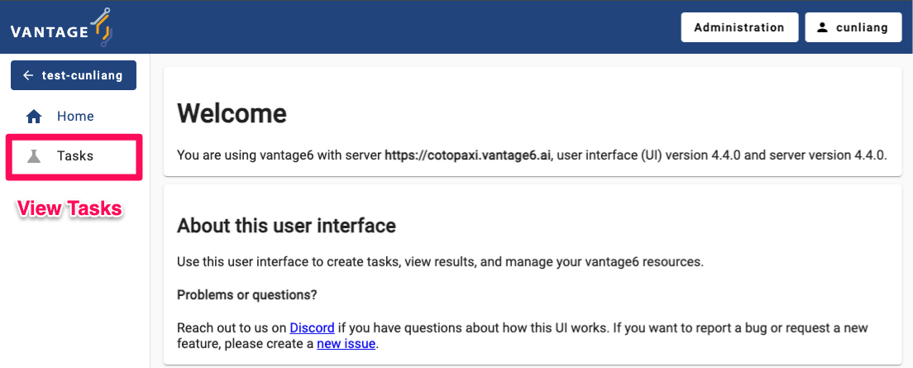

The start page contains an `Administration` icon in the left panel. Clicking on this button will expand it with the vantage6 entities youn can manage: `Organizations`, `Collaborations`, `Roles`, `Users`, and `Nodes`. You can click on an entity to see more details or to edit the entity. We will get back to this later in more detail.

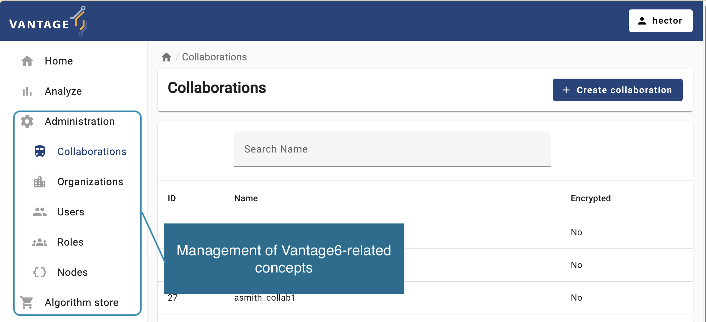

::::::::::::::::::::::::::::::::::::: challenge

## Get familiar with the vantage6 UI

Log in to the Vantage6 UI using the credentials given by the instructors. Once logged in, navigate to the administration page to familiarize yourself with the entities there. Then, try to update your email, first name, and last name, but do not change your username.

::::::::::::::::::::::::::::::::::::::::::::::::

:::::::::::::::::::::::: solution

## Solution

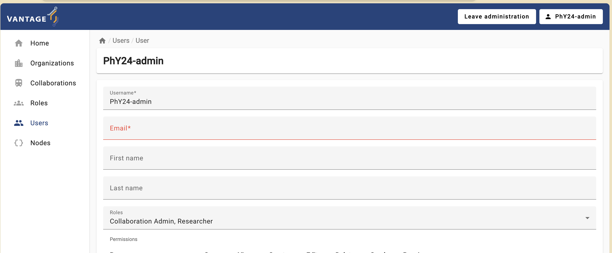

:::::::::::::::::::::::::::::::::

## From theory to practice: a hypothetical case study using vantage6 collaborations

As discussed in [Episode 2](./chap2_introduction_v6.md), in vantage6 a collaboration refers to an agreement between two or more parties to participate in a study or to answer a research question together. This concept is central to the Privacy Enhancing Technologies (PETs) that vantage6 supports. Each party involved in a collaboration remains autonomous, meaning they retain control over their data and can decide how much of their data to contribute to the collaboration's global model and which algorithms are allowed for execution.

To illustrate this, let's analyze a hypothetical scenario: an international collaboration project of multiple health research institutes, working together on two studies:

- _Age-Related Variations in Overweight Prevalence: A Comparative Study Across Gender and Age Groups_ **(AGOT2024)** .

- _The Effect of Gender on Height Development Across Various Age Groups_  **(GGA2024)**.

The first study, **AGOT2024**, involves the analysis of age and weight-related data available on a subset of the institutions participating in the collaboration. Likewise, **GGA2024** involves the analysis of age and height-related data from a different (and potentially overlapping) subset of the collaboration's participants. The diagram below illustrates the kind of configuration you will be working with. Keep in mind that your configuration may have different node and collaboration names, an different study subsets.

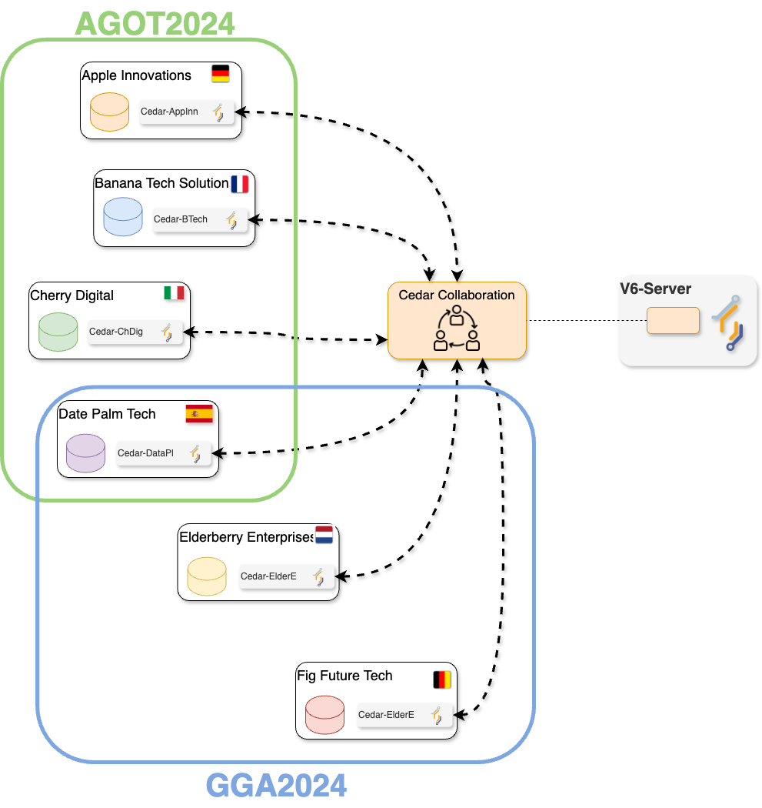

### Running a PET (privacy-enhancing technology) analysis without programming!

In this episode, you will perform a PET analysis on an existing vantage6 collaboration (based on 'dummy' nodes) that resembles the two described above. For reference, the datasets of each organization can be seen here (TODO).

::::::::::::::::::::::::::::::::::::: challenge

## Challenge 2: understanding a simple federated algorithm

First, let's take a look at one of the federated algorithms -available on the vantage6's community store- that will be used in this episode: [a federated average](https://github.com/IKNL/v6-average-py/blob/master/v6-average-py/__init__.py).

Analyze the algorithm based on the code and its comments and answer the following questions:

- How are the `central_average` and `partial_average` functions related?
- Why does the `central_average` function, unlike `partial_average`, **not** get any data as an input?
- Analyze and discuss the potential outcomes if a Task to execute `central_average` is initiated within a collaboration or study where one of the nodes is offline.

::::::::::::::::::::::::::::::::::::::::::::::::

::::::::::::::::::::::::::::::::::::: challenge

## Challenge 3: exploring the status of the collaboration its related studies

The instructors will provide you credentials for accessing as a researcher of one of the institutions from the collaboration.

Using these credentials see which institutions were asigned to the two studies. Also check the status of the corresponding nodes. Given this and your algorithm analysis from Challenge #2 answer the following:

1. Which study is ready for creating a Task for the **federated average** algorithm?
2. If one of the studies is not ready, which organization you would need to contact in order to make it ready for executing the algorithm too?

::::::::::::::::::::::::::::::::::::::::::::::::

:::::::::::::::::::::::: solution

## Solution steps

To check the status of the nodes of each collaboration:

1. Log in to each one with the given credentials
2. Click on 'Administration' on the left panel of the UI
3. select 'Collaborations', and then select the corresponding collaboration.
4. If there are 'offline' nodes, click on the 'Nodes' panel on the left and check when these were seen for the last time.

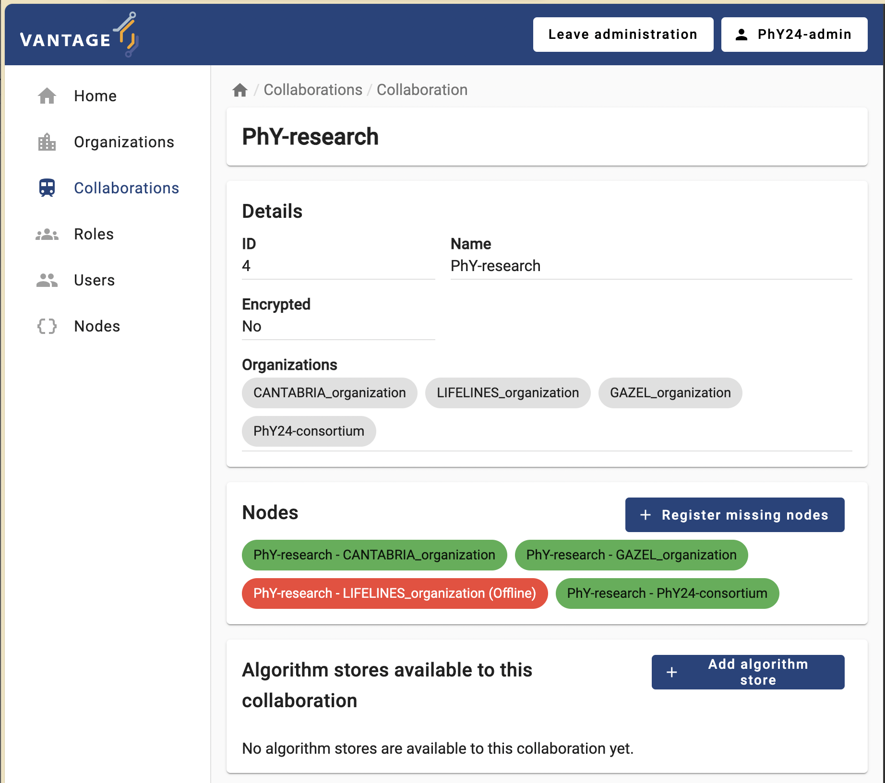

:::::::::::::::::::::::::::::::::

::::::::::::::::::::::::::::::::::::: challenge

## Challenge 4: as a researcher, requesting an algorithm execution!

Now, you'll play the role of the researcher within the collaboration you have just examined. With this role, you will finally request the execution of the algorithm.

1. Log in with the credentials provided by the instructors.

2. Select `Analyze` on the Administration option from the panel on the left, and then select your collaboration.

3. Select `+ Create task` to create a new task on your collaboration.

   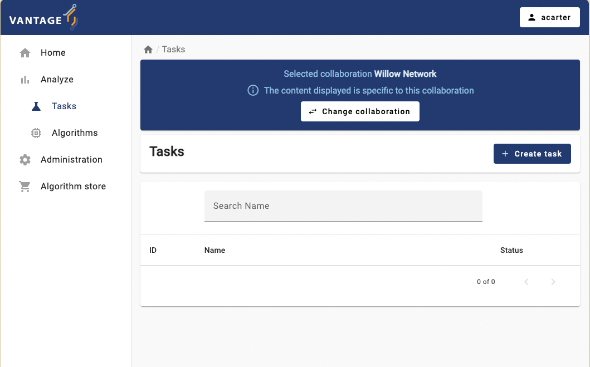

4. As the first step, you can choose between running the task on the entire collaboration, or on one particular study (i.e., on a subset of the collaboration's institutions). Choose the study that, according to what you saw when working on Challenge #3, is still NOT ready to execute a _federated average_ task.

   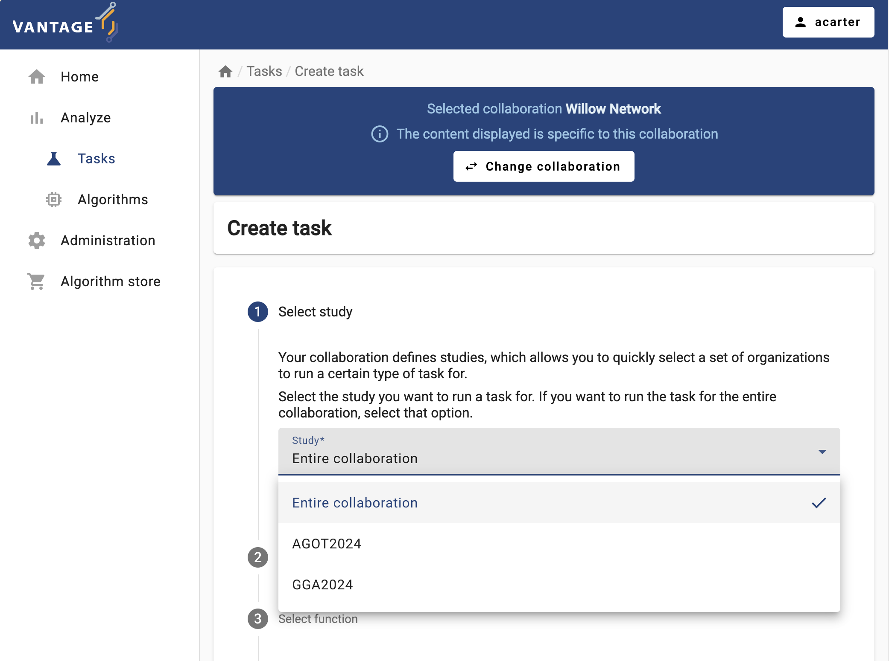

5. The 'Average' algorithm should be listed under the '_Select which algorithm you want to run_' dropdown menu. Select it, and provide a name and a description.

   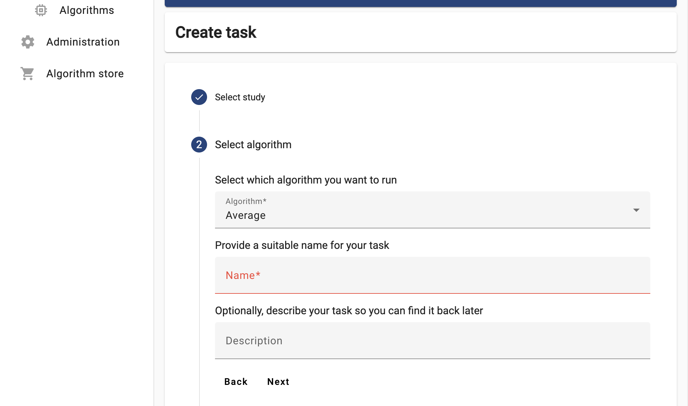

6. Now the UI will let you choose between the two functions you explored in Challenge #2. For now try to run the `partial_average`, selecting ALL the organizations.

   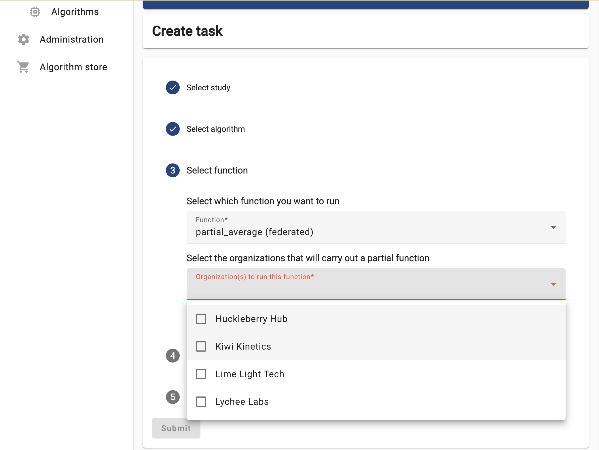

7. Select the 'default' database, choose any numerical column relevant for the study you selected, and then click on 'Submit'.

8.  The task you just requested should be listed with a 'pending' status. Once finished, explore and download the provided results.
   
Based on these results, answer the following:

1. What just happened? Did the `partial_average` function fail or not?

2. If you do the same process, this time on the study that is ready for new task, and using the `central_average` function (refer to Challenge #2 if needed), which organization or organizations should you choose this time? Experiment with this and discuss the results with the instructors.

3. What would happen if you select an alpha-numerical column (e.g., 'gender')? Do this experiment and explore the generated error logs. Discuss with the instructors how these logs can be used to diagnose any task execution issues.

::::::::::::::::::::::::::::::::::::::::::::::::
