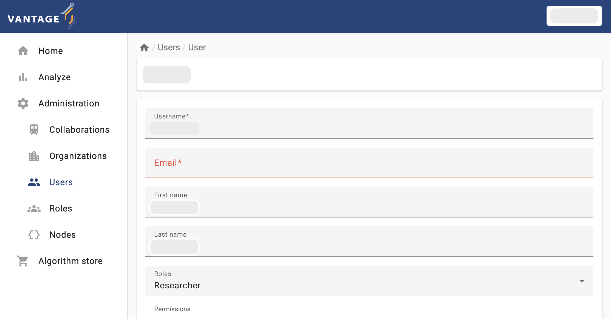
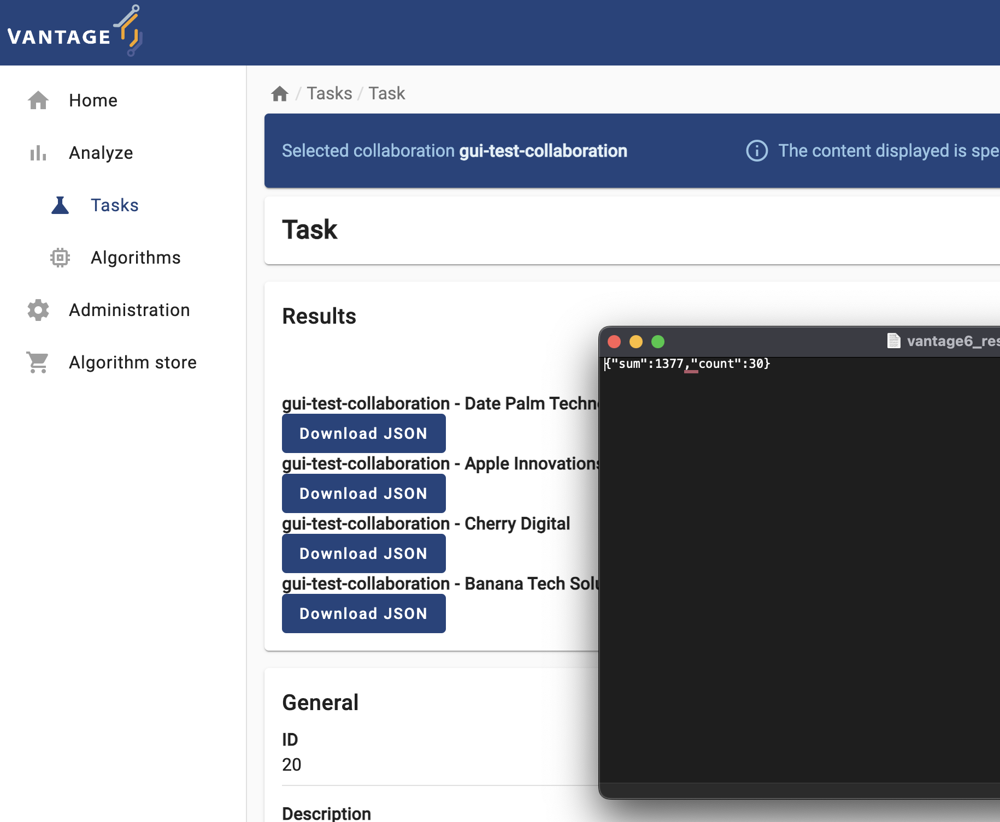
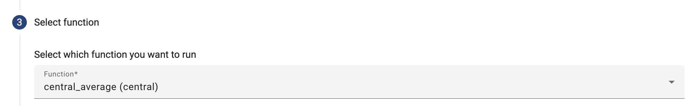
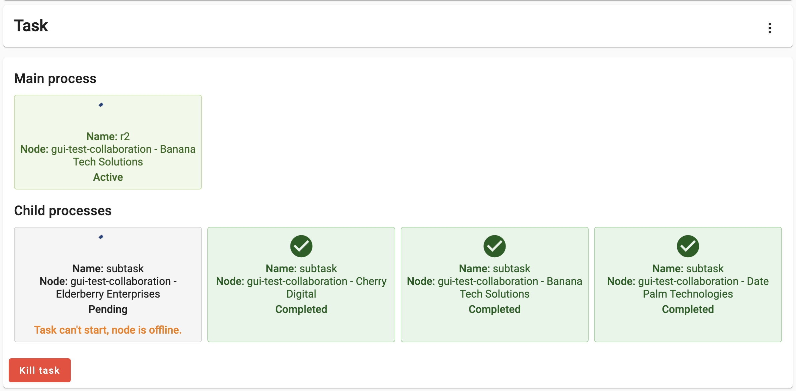
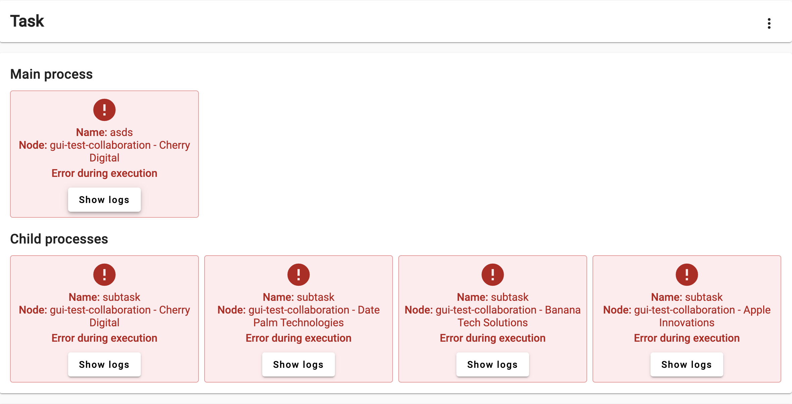

:::::::::::::::::::::::::::::::::::::: questions

- How can I perform basic administrative activities on vantage6 using the web-based UI?
- How do I check the status of a specific collaboration or study in the vantage6 UI?
- How do I request a task through the vantage6 UI?

:::::::::::::::::::::::::::::::::::::::::::::::::

::::::::::::::::::::::::::::::::::::: objectives

- Explore specific data analysis scenarios that further illustrate the concepts introduced in episode 2. 
- Understand the UI-based workflow for performing a data analysis on the given scenarios.

::::::::::::::::::::::::::::::::::::::::::::::::

:::::::::: prereq

# Prerequisite
Make sure you completed the [Episode 2](./chap2_introduction_v6.md) where the concepts the UI is based on are introduced.

:::::::::::::::::

## From theory to practice: a hypothetical case study using vantage6 collaborations

In vantage6 a collaboration refers to an agreement between two or more parties to participate in a study or to answer a research question together. This concept is central to the Privacy Enhancing Technologies (PETs) that vantage6 supports. Each party involved in a collaboration remains autonomous, meaning they retain control over their data and can decide how much of their data to contribute to the collaboration's global model and which algorithms are allowed for execution.

To illustrate this in practice, you will work on a simulated collaboration scenario: an international consortium project of multiple health research institutes, working together on two studies:

- _Age-Related Variations in Overweight Prevalence: A Comparative Study Across Gender and Age Groups_ **(AGOT2024)** .

- _The Effect of Gender on Height Development Across Various Age Groups_  **(GGA2024)**.

The first study, **AGOT2024**, involves the analysis of age and weight-related data available on a subset of the institutions participating in the collaboration. Likewise, **GGA2024** involves the analysis of age and height-related data from a different (and potentially overlapping) subset of the collaboration's participants. In this Episode you will play the role of a researcher  of one of the institutions that conform the consortium. As seen on the previous [Episode](./chap2_introduction_v6.md), this means that you will be able to perform data analysis on the whole collaboration, or on any of the two studies defined for it. The following illustrates the kind of collaboration you will be part of (yours may have a different number of nodes, with different names and study configurations).

The consortium members already took care to ensure that their corresponding datasets follow the same structure (variable names and data types). This is key for making the federated analysis possible. 
The following is an example of how the 'default' database on all the nodes within the collaboration look like.

| Gender | Age | Height | Weight | IsOverweight | AgeGroup  |
|--------|-----|--------|--------|--------------|-----------|
| M      | 39  | 152    | 108    | False        | 30 - 40   |
| M      | 8   | 118    | 106    | False        | 0 - 10    |
| M      | 16  | 161    | 110    | True         | 10 - 20   |
| M      | 94  | 110    | 115    | True         | 90 - 100  |
| M      | 47  | 117    | 152    | True         | 40 - 50   |
| F      | 29  | 127    | 110    | True         | 20 - 30   |
| M      | 5   | 95     | 65     | False        | 0 - 10    |
| M      | 39  | 142    | 196    | False        | 30 - 40   |
| F      | 20  | 189    | 112    | False        | 20 - 30   |
| F      | 84  | 145    | 116    | False        | 80 - 90   |

## Interacting with the v6 server

To perform a data analysis, or any other kind of management activity within the collaboration you are part of, you need to interact with the vantage6 server. As described in [Episode 2](./chap2_introduction_v6.md), the vantage6 server is the central component responsible for managing the entire federated/multi-party computation infrastructure and facilitating communication between the various entities within the vantage6 platform. There are two ways of interacting with the server: either by using a web-based user interface, or by programmatically requesting actions to the server API -the same API that powers the web interface behind the scenes. In this Episode you will perform data analyses on the simulated collaboration scenario using the web-based interface, the most user-friendly one (in [Episode 4](./chap4_manage_via_ui.md) you will learn how to configure your own collaborations, and on [Episode 5](./chap5_python_client.md), you will explore how to interact with the server programmatically for more advanced use cases).

### Navigating through vantage6's UI

The elements and navigability of vantage6's UI are based on the concepts introduced in [Chapter 2](./chap2_introduction_v6.md). For instance, as seen on the screenshots below, upon selecting a collaboration on the start page, if you select 'Tasks' you will see the status of the tasks created for that particular collaboration.

Likewise, expanding the `Administration` icon in the left panel will let you choose vantage6 entities youn can manage: `Organizations`, `Collaborations`, `Roles`, `Users`, and `Nodes`. You can click on an entity to see more details or to edit the entity. 

::::::::::::::::::::::::::::::::::::: challenge

## Getting familiar with the vantage6 UI

To get familiar with vantage6's UI, you will start with a simple task: edit the details of your own user (the connection details for this activity will be given by the instructors). Log into the UI using the information provided and navigate to the administration page and try to update your email, first name, and last name.

::::::::::::::::::::::::::::::::::::::::::::::::

:::::::::::::::::::::::: solution

## Solution

:::::::::::::::::::::::::::::::::

## Running a PET (privacy-enhancing technology) through the user interface (no coding involved!)

Now that you are familiar with the UI basics, the next two details you need to figure out as a researcher, in order to perform you analysis are (1) which kind of analysis I need perform, and (2) on which data nodes it will be peformed? There is another important consideration, though: is my collaboration or my studies ready for my analysis? Keep in mind that each node within your collaboration is autonomously managed by the organization it was configured. This means that you although you can include them in your analysis, you can't control them (they may just be offline for no reason).

::::::::::::::::::::::::::::::::::::: challenge

## Challenge 2: checking the status of the nodes through the UI

With your researcher credentials, explore the collaboration you have access to. Check which organizations are part of it and if they are online. Also check which organizations were assigned to each study (AGOT2024, GGA2924). Based on this:

1. Which study is ready for executing an analysis?
2. If you need to perform an analysis for the study that is **not** ready, which organization you would need to contact to fix this situation? 

::::::::::::::::::::::::::::::::::::::::::::::::

### Running a federated algorithm

Now you will perform an analysis on the _study_ that is ready for it (i.e., the _study_ with **no** offline nodes). As this is an introductory exercise, you will first use the simple algorithm introduced in [Chapter 2](./chap2_introduction_v6.md): the _Federated Average_.

::::::::::::::::::::::::::::::::::::: challenge

## Challenge 3: as a researcher, requesting an algorithm execution! (partial function)

1. Login with your researcher credentials.

2. Select `Analyze` on the Administration option from the panel on the left, and then select your collaboration.

3. Select `+ Create task` to create a new task on your collaboration.

   

4. As the first step, you can choose between running the task on the entire collaboration, or on one particular study (i.e., on a subset of the collaboration's institutions). Choose the study that is _ready_ for an analysis.

   

5. The 'Average' algorithm should be listed under the '_Select which algorithm you want to run_' dropdown menu. Select it, and provide a name and a description.

   

6. Now the UI will let you choose between the two functions you explored in Challenge #2. For now try to run the `partial_average`, selecting ALL the organizations.

   

7. Select the 'default' database, choose any numerical column relevant for the study you selected, and then click on 'Submit'.

8.  The task you just requested should be listed with a 'pending' status. Once finished, download the JSON results and open them on a text editor.
   
Based on these results, discuss the following:

1. What does the content of these files mean? Why the `central_average` function is returning this?

::::::::::::::::::::::::::::::::::::::::::::::::

:::::::::::::::::::::::: solution

## Solution

Each node, after executing the `partial_average` function, returns the two values needed by the central function of the 'federated average' algorithm (as described in Chapter 2): the number of records within the database, and their sum. These values are ‘encoded’ as a JSON document, so they can be read, programatically, by the `central_average`.

:::::::::::::::::::::::::::::::::

::::::::::::::::::::::::::::::::::::: challenge

## Challenge 4: let's see what the central function does!

Repeat the same process from Challenge 3 (again, on the Study that is ready for it), but this time choose the 'central' function. As you see, when choosing this function only one organization can be selected. 

Once again, wait for the process to finish and check the JSON results. Keep an eye on the Tasks section, and see how the processes are created. 

Discuss the following:

1. There is a node that appeared twice in the processes list during the algorithm execution: in the Main process and on the Child processes list. Take a look at the source code of the [algorithm you have just executed](https://github.com/IKNL/v6-average-py/blob/master/v6-average-py/__init__.py). Can you spot in the code why this happened?

2. Can you identify, within the same source code, where the data you saw on Challenge 3 was created? 

3. Given the source code above, why does the `central_average` function, unlike `partial_average`, **not** get any data as an input?

::::::::::::::::::::::::::::::::::::::::::::::::

:::::::::::::::::::::::: solution

## Solution

1. In this exercise you created a task for a 'central' function, which, when executed requests other nodes to run a 'partial' one, combining their results upon completion. The central function is designed in a way that it make the request to all the nodes within the collaboration/study. As the node that gets the request to execute the 'central' function, is also part of the collaboration, it ends executing two tasks: the central task, and the partial one.
2. [Here,](https://github.com/IKNL/v6-average-py/blob/5cad1742749de0f5c05a788c8ce3ca5b0a3965b2/v6-average-py/__init__.py#L87) the 'partial' part of the algorithm encodes its result as the JSON document seen on the previous challenge.

3. The `central_average` function is designed just to aggregate the results of the partial averages sent by the other nodes. Hence, it doesn’t need direct access any dataset.

:::::::::::::::::::::::::::::::::

::::::::::::::::::::::::::::::::::::: challenge

## Challenge 5: handling problems through the UI!

Based on your current understanding of the *federated average* algorithm, speculate on what would happen if you run the 'central' function of this algorithm on a study that includes 'offline' nodes. Once you have made your prediction, validate it by repeating the process from the previous challenge, this time using the _study_ with the 'offline' node.

Discuss the following:

1. What happened with the Task? What can you do about it with the UI?

::::::::::::::::::::::::::::::::::::::::::::::::

:::::::::::::::::::::::: solution

## Solution

The algorithm didn’t crash, but is kept on hold (with the Active status) indefinitely. The Central task requests all the nodes in the study to run the ‘partial’ function. As the server is unable to transfer this request to the offline node, this child process is kept on hold, until the node is back online.

Consequently, the Main process is also kept on hold, and the process stays with an ‘Active’ status indefinitely (or until the node is back online).

:::::::::::::::::::::::::::::::::

::::::::::::::::::::::::::::::::::::: challenge

## Challenge 6: handling problems through the UI, again.

This time, let's try to do something that may make the _federated average_ algorithm not work as expected. Create a task, this time selecting the 'operational' study (the one with all of its nodes online), and use the central function in it. This time, choose a non-numerical variable (see the table sample).

Look at the logs and discuss the following:

1. Why did both `partial_function` and `central_function` crash? ([See source code](https://github.com/IKNL/v6-average-py/blob/5cad1742749de0f5c05a788c8ce3ca5b0a3965b2/v6-average-py/__init__.py))

::::::::::::::::::::::::::::::::::::::::::::::::

:::::::::::::::::::::::: solution

## Solution

1. The `partial_function` crashed while trying to parse the input as a number. The `central_function` crashed due to a division-by-zero.

:::::::::::::::::::::::::::::::::

