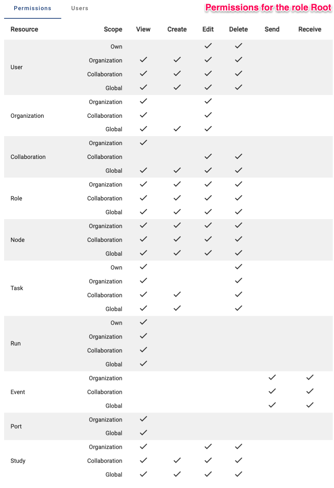
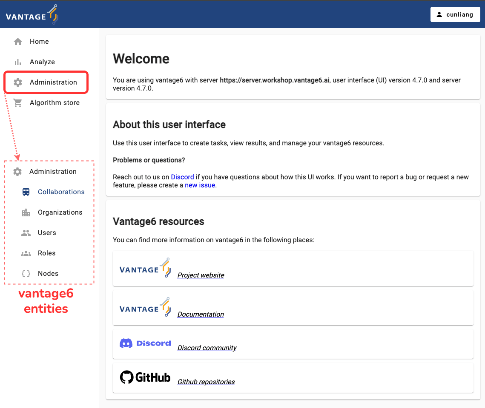
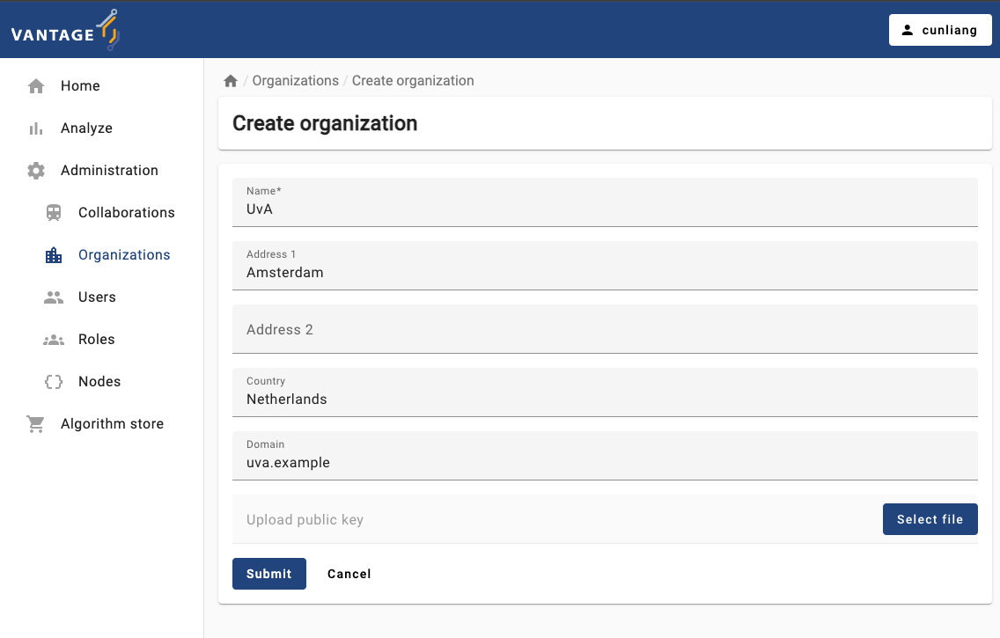
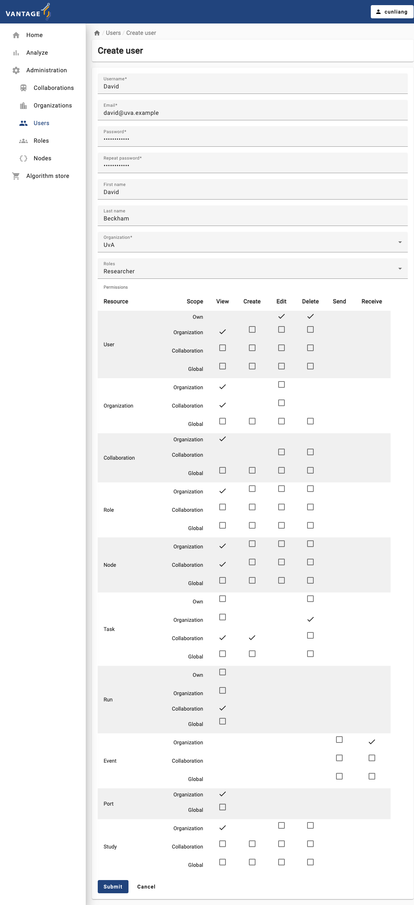
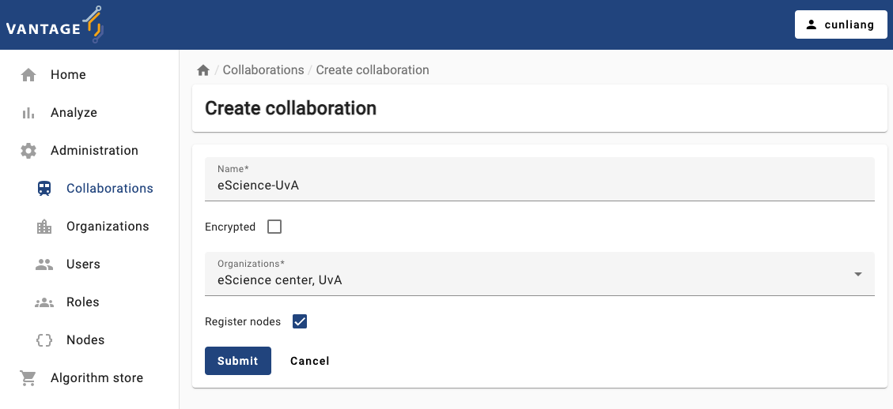
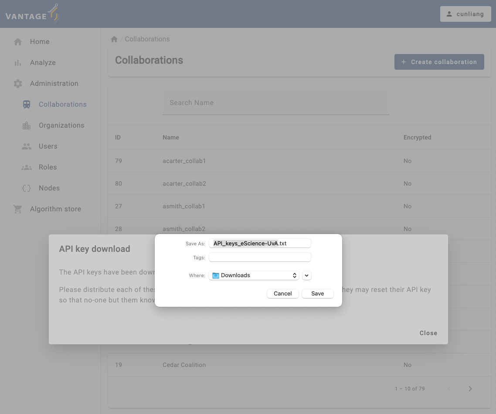
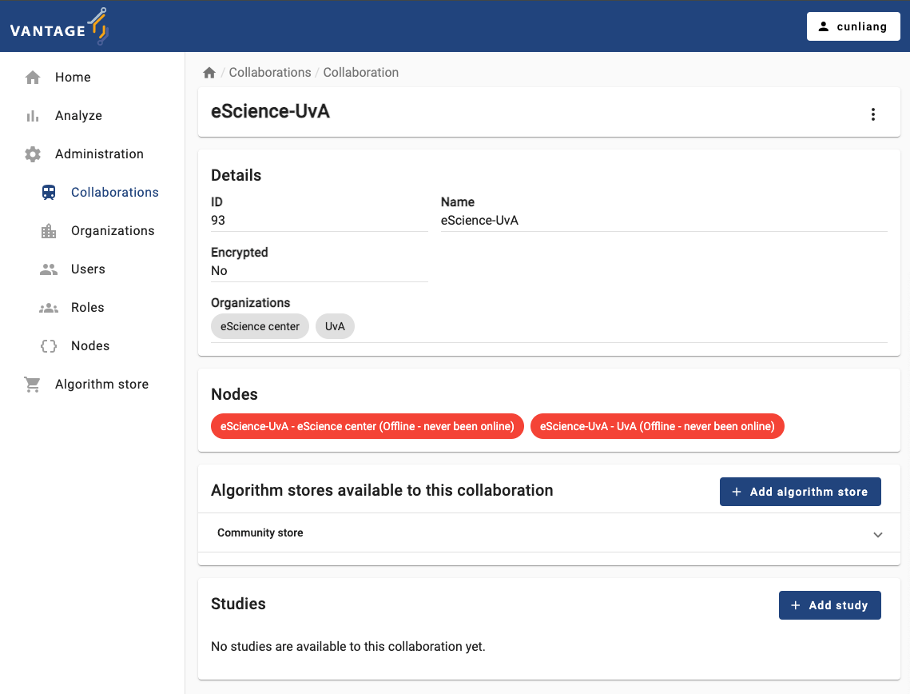

:::::::::::::::::::::::::::::::::::::: questions

- What is the permission system in vantage6?
- What are the default roles in vantage6?
- How to create a new organization using vantage6 user interface (UI)?
- How to create a new user using vantage6 UI?
- How to create a new collaboration using vantage6 UI?

:::::::::::::::::::::::::::::::::::::::::::::::::

::::::::::::::::::::::::::::::::::::: objectives

- Understand the permission system of vantage6
- Understand the default roles in vantage6
- Be able to create a new organization using the vantage6 UI
- Be able to create a new user using the vantage6 UI
- Be able to create a new collaboration using the vantage6 UI

::::::::::::::::::::::::::::::::::::::::::::::::

## Vantage6 permission system

Vantage6 uses a permission system to control who can do what in the system. The permission system is based on **roles**, which are collections of rules that define the permissions of a user. A user can have multiple roles, and the permissions of the user are defined by the assigned **rules**.

The permission rules define what each entity is allowed to do, based on the operation (view, create, edit, delete, send, receive), the scope (own, organization, collaboration, global), and the resource (e.g. users, organizations). Users can be assigned anywhere between zero and all of these permission rules. For example, having the rules with `create` in the scope `organization` for the resource `user` means that the user can create users for the organization they belong to.

Note that not every resource has all scopes and/or operations. For example, the `collaboration` resource does not have `create`  operation for the `organization` scope, as it does not make sense to create a collaboration that only your own organization can participate in.

To make it easier to assign permissions, there are also predefined roles:

- Root: has all permissions (👉 see image below)
- Collaboration Admin: can do almost everything for all organizations in collaborations they are a member of
- Organization Admin: can do everything for their own organization
- Researcher: can view the organization's resources and create tasks (👉 see image below)
- Viewer: can only view the organization's resources

The permissions are set up in the `Roles` tab in the administration page. You can click on a role to see the permissions of that role. You can also create a new role by clicking the `Create role` button.

The permission structure allows for a lot of flexibility, but it can be complex for beginners to set up. The default roles provide a quick way to set up permissions, but it is recommended to review them before using them in a project.

::::::::::::::::::::::::::::::::::::: challenge

## Challenge 1: What can you do in vantage6?

Go the administration page in the vantage6 UI, check the permissions that you have, and answer the following questions:

1. What is your role in vantage6?
2. Do you have the permissions to create a new organization, a new user or a new collaboration?
3. Do you have the permission to remove an existing organization, a user, or a collaboration?

:::::::::::::::::::::::: solution

## Output

1. Check it with your instructor.
2. Yes, you should be able to create a new organization, a new user, and a new collaboration. If not, ask your instructor to give you the necessary permissions.
3. Check it with your instructor.

:::::::::::::::::::::::::::::::::
::::::::::::::::::::::::::::::::::::::::::::::::

## Manage vantage6 project using the UI

::::::::::::::::::::::::::::::::::::::::::::::::::::::: instructor

Before starting this section, make sure that the participants have enough permissions to create a new organization, a new user, and a new collaboration. If not, give them the necessary permissions.
Note that the role `Collaboration Admin` does not have the permission to create a new organization.

::::::::::::::::::::::::::::::::::::::::::::::::::::::::::::::::::

In this section, we will go through the steps to create a new organization, a new user and a new collaboration using the vantage6 UI.

First you need to log in to the vantage6 UI, and then go to the `Administration` page. You can find the `Administration` tab in the left side of the start page. Clicking on the `Administration` tab will show you all tabs for vantage6 entities.

### Create a new organization

It's quite straightforward to create a new organization in vantage6. Here are the steps:

1. Click on the `Organizations` tab in the administration page.
2. Click on the `Create organization` button.
3. Fill in the details of the new organization.
   - The `Upload public key` field is optional. You can upload a public key for the organization if you want to use encryption in the collaboration. But note that we DO NOT use encryption in this course.
4. Click on the `Submit` button to create the new organization.

### Create a new user

Now let's create a new user for the organization we just created. Here are the steps:

1. Click on the `Users` tab in the administration page.
2. Click on the `Create user` button.
3. Fill in the details of the new user.
   - You can assign the user to an organization by selecting it from the `Organization` dropdown. Only one organization can be selected.
   - You can assign roles to the user by selecting them from the `Roles` dropdown. Here we assign the `Researcher` role to the new user. You can give the user more permissions by assigning multiple roles or select the operation boxes in the `Permissions` section.
4. Click on the `Submit` button to create the new user.

### Create a new collaboration

A collaboration is a collection of one or more organizations. Let's create a new collaboration between two organizations. Here are the steps:

1. Click on the `Collaborations` tab in the administration page.
2. Click on the `Create collaboration` button.
3. Fill in the details of the new collaboration.
   - For `Encrypted` box, you can select whether the collaboration should be encrypted or not.
   - You can select the organizations that will participate in the collaboration by selecting them from the `Organizations` dropdown.
   - By default, we select the `Register nodes` box. This will ensure the nodes of the organizations are registered in the collaboration. If you don't select this box, you will have to register the nodes manually later.

4. Click on the `Submit` button to create the new collaboration.
   - After submitting the form, you may see a dialog box to ask you to download the API key (on MacOS) or a dialog points out that the API key has been downloaded (on Windows). The API key is used to authenticate the nodes in the collaboration.

You will see a message:

> API key download
>
> The API keys have been downloaded.
>
> Please distribute each of these keys privately to each of the organizations. Note that they may reset their API key so that no-one but them knows it.

You will need the API keys when you run the nodes to authenticate with the vantage6 server. Please save the API keys properly, we will need it in [Chapter 6](./chap6_setup_node.md).

5. After creating the collaboration, you can see the details of the collaboration by clicking on the specific collaboration listed in the `Collaborations` tab.
   - You will see what organizations are participating in the collaboration.
   - You will see the nodes of the organizations that are registered in the collaboration. In case one or more organizations did not register their nodes when creating or updating the collaboration, you can register them manually by clicking the `Register missing nodes` button. Note that this button is not visible if all nodes are registered.
   - You can also see the algorithm store available for the collaboration. You can add a algorithm store for the collaboration by clicking the `Add algorithm store` button.
   - You can also see the studies of the collaboration. You can add a study by clicking the `Add study` button.

::::::::::::::::::::::::::::::::::::: challenge

## Challenge 2: Manage vantage6 project using the UI

Go to the administration page in the vantage6 UI, and do the following:

1. Create a new organization
2. Create a new user (`Researcher` role plus the permission to view their own task)
3. Check what permissions you have, can you create a new user and grant them the permissions you don't have?
4. Create a new collaboration

Which steps are challenging for you?

::::::::::::::::::::::::::::::::::::::::::::::::

::::::::::::::::::::::::::::::::::::: keypoints

- Vantage6 uses a permission system to control who can do what in the system.
- Vantage6 has default roles like `Root`, `Collaboration Admin`, `Organization Admin`, `Researcher`, and `Viewer`.
- Vantage6 UI can be used to manage the entities of vantage6, like creating or deleting an organization, a user, or a collaboration.

::::::::::::::::::::::::::::::::::::::::::::::::
