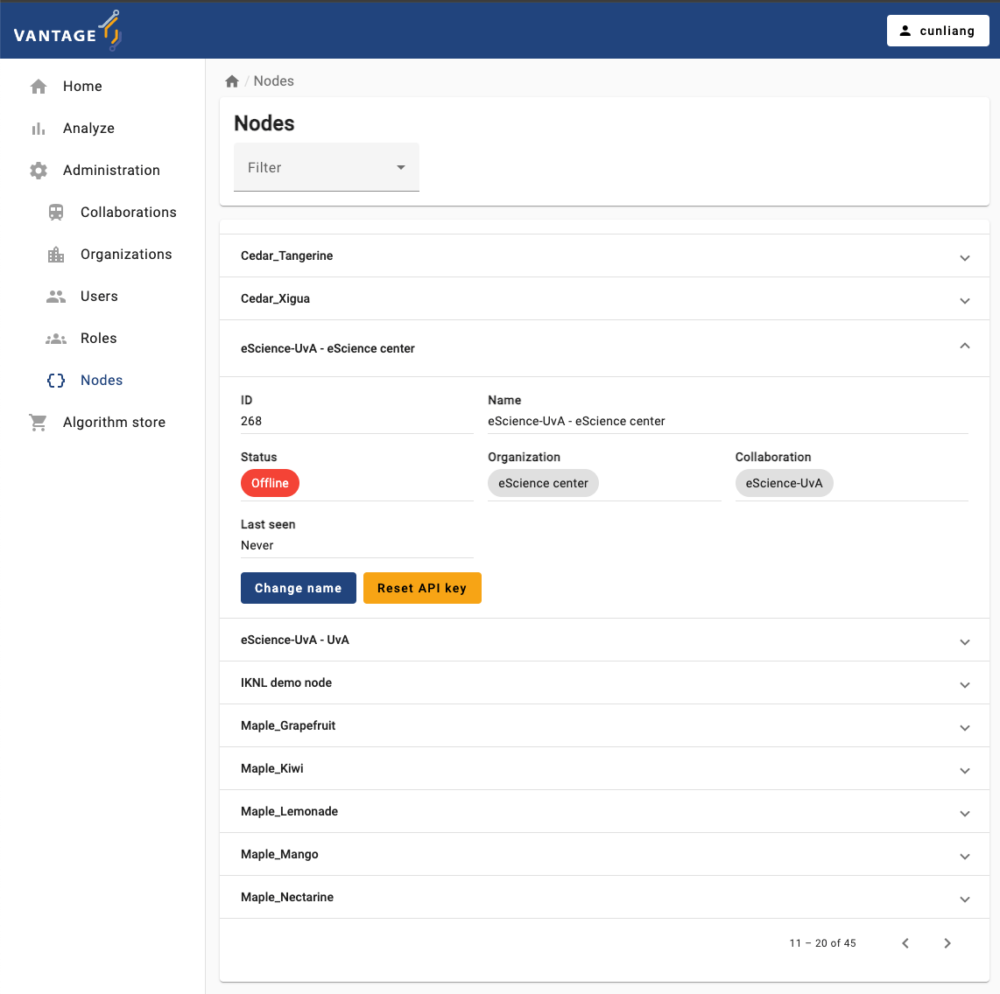
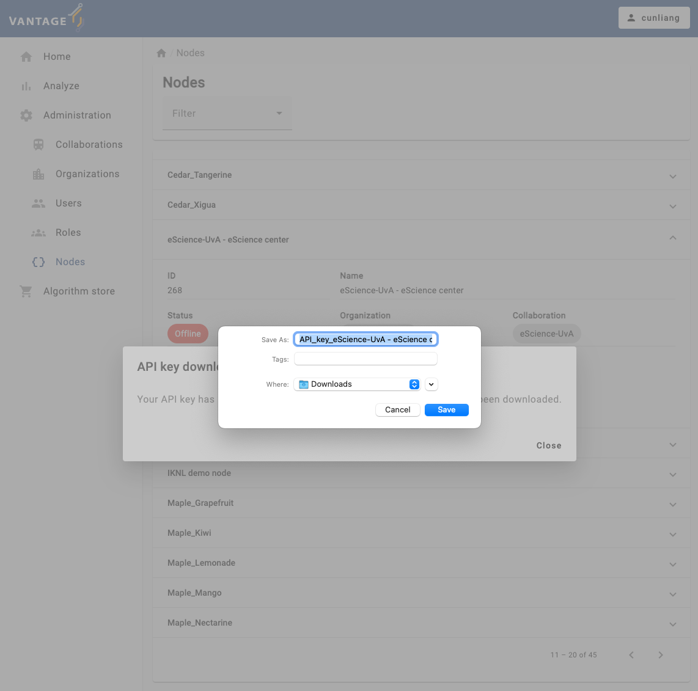

:::::::::::::::::::::::::::::::::::::: questions

- What are the requirements to install a node?
- How to install the command line interface (CLI)?
- Which commands are available in the CLI?
- How to set up a new node?
- How to reset and update an API key?

:::::::::::::::::::::::::::::::::::::::::::::::::

::::::::::::::::::::::::::::::::::::: objectives

- Understand the requirements for setting up vantage6 node
- Understand the basic `v6` commands
- Be able to create a new vantage6 node using `v6` commands
- Be able to reset and update an API key for a node
- Be able to observe the logs of vantage6 node

::::::::::::::::::::::::::::::::::::::::::::::::


::::::::::::::::::::::::::::::::::::::::::::::::::::::: instructor

This lessons requires the instructor to type commands in the terminal and show the output to the learners.

To make sure the learners can follow along, the instructor should explain each command before executing it,
and go through or explain the output after executing it.

Also, it's recommended to use a light background in the terminal to make the text more readable. You
could choose one color theme from https://iterm2colorschemes.com/.

And you should change the shell prompt in terminal to easy-to-catch one, e.g. red arrow:

```bash
# BASH shell
export PS1='\[\e[31m\]-->\[\e[0m\] '
```

```zsh
# ZSH shell
export PROMPT='%F{red}-->%f '
```

::::::::::::::::::::::::::::::::::::::::::::::::::::::::::::::::::

Vantage6 node is the software that runs on a data station. It allows the data owner to share their data within the vantage6 network in a privacy enhancing way. Also, it is responsible for the execution of the federated learning tasks and the communication with the vantage6 server.

Each organization that is involved in a federated learning collaboration has its own node in that collaboration. They should therefore install the node software on a (virtual) machine hosted in their own infrastructure. The machine should have access to the data that is used in the federated learning collaboration.

This chapter will explain how to set up and run the vantage6 node software.

## Requirements on hardware and software

### Hardware requirements

The minimal hardware requirements are:

- x86 CPU architecture + virtualization enabled. This setting is usually the default in most of the systems.
- 1 GB memory
- Sufficient storage to install Python, docker and vantage6, and to store the required docker images (50GB+ recommended).
- Stable and fast internet connection (1 Mbps+).

The hardware requirements of vantage6 node also depend on the algorithms that the node will run. For example, you need much less compute power for a descriptive statistical algorithm than for a machine learning model.

Even though a vantage6 node can be installed and run on Linux, Windows and Mac, Linux is the recommended OS.

In this lesson, you will use your laptop, but in a production scenario, we recommend to use a server or virtual machine to run the node.

### Software requirements

The following software must be installed before installing the vantage6 node:

- Recommended operating system: Ubuntu 20.04+ , MacOS Big Sur+, or Windows 10+
- Docker Desktop (Windows, MacOS) or the Docker Engine (Linux)
- Miniconda (latest version)
- Python v3.10
- Python packages:
  - [vantage6==4.7.1](https://pypi.org/project/vantage6/)
  - [jupyterlab](https://pypi.org/project/jupyterlab/)

You should already have installed the requirements before coming to this lesson. They are detailed in the [Setup section](../setup.md).

::: callout

## ⚠️ Docker installation

- For Linux users, some [post-installation steps](https://docs.docker.com/engine/install/linux-postinstall/) may be required (as also mentioned in the [setup section](../setup.md)). Vantage6 needs to be able to run docker without sudo, and these steps ensure just that.

- For Windows users, if you are using Docker Desktop, it may be preferable to limit the amount of memory Docker can use - in some cases it may otherwise consume much memory and slow down the system. This may be achieved as described [here](https://stackoverflow.com/questions/62405765/memory-allocation-to-docker-containers-after-moving-to-wsl-2-in-windows).

:::

## Installation

The Python package `vantage6` provides a command-line interface (CLI) to manage the vantage6 infrastructure.

To install this CLI package, run the following command in your Python environment, provided you had not done so already in the [Setup section](../setup.md):

```bash
# First go to your python virtual environment
conda create -n v6-workshop python=3.10
conda activate v6-workshop

# Then install the package
pip install vantage6 jupyterlab
```

To verify the installed CLI, run the command,

```bash
v6 --help
```

If the installation is successful, it will print out a message explaining the CLI usage.

## `v6 node` commands

The vantage6 CLI provides the `v6 node` command to manage the vantage6 node instances.

To see how to use it, run the command `v6 node --help` in your terminal, and it will print out the following messages:

```bash
Usage: v6 node [OPTIONS] COMMAND [ARGS]...

  Manage your vantage6 node instances.

Options:
  --help  Show this message and exit.

Commands:
  attach              Show the node logs in the current console.
  clean               Erase temporary Docker volumes.
  create-private-key  Create and upload a new private key
  files               Prints the location of important node files.
  list                Lists all node configurations.
  new                 Create a new node configuration.
  remove              Delete a node permanently.
  set-api-key         Put a new API key into the node configuration file
  start               Start the node.
  stop                Stop one or all running nodes.
  version             Returns current version of a vantage6 node.
```

For example, to view the list of available nodes, you can run the command `v6 node list`.

### View the list of nodes

You can use the `v6 node list` command to see the list of nodes:

```bash
v6 node list
```

If it print out a long error message, it means the Docker engine is not running:
```bash
Cannot reach the Docker engine! Please make sure Docker is running.
Error while fetching server API version: 502 Server Error for http+docker://localhost/version: Bad Gateway
Traceback (most recent call last):
...
```
⚠️ Please make sure Docker is running when you're using the `v6 node` commands.

::: callout

### Start Docker engine

- For Windows and MacOS, open Docker Desktop to start the Docker engine.
- For Linux, Docker engine usually starts automatically when you login. Otherwise, use the commmand `sudo systemctl start docker` to start the Docker engine.

:::

If the Docker engine is running, you will see the following message:

```bash
Name                     Status          System/User
-----------------------------------------------------
-----------------------------------------------------
```

You don't see any nodes in the list because you haven't created any nodes yet. Next, we will create a new node configuration.

## Configure a new node

We will now create a new node configuration using the `v6 node new` command for the collaboration we created in [Chapter 4](./chap4_manage_via_ui.md).
This process will create a configuration `yaml` file that the vantage6 node requires to run.

⚠️ Make sure you have the API key downloaded from the vantage6 UI in [Episode 4](./chap4_manage_via_ui.md#create-a-new-collaboration). If you haven't done so or lost the API key, you can reset the API key for the node in the vantage6 UI, check the [Reset API key for a node via the vantage6 UI](#reset-api-key-for-a-node-via-the-vantage6-ui) section.

::::::::::::::::::::::::::::::::::::::::::::::::::::::: instructor

Display the downloaded API key file and there should be at least two API keys for two organizations in the collaboration.

::::::::::::::::::::::::::::::::::::::::::::::::::::::::::::::::::


Let's run the command:

```bash
v6 node new
```

The command will show a wizard to guide you through the configuration process in a step-by-step manner:

```bash
? Please enter a configuration-name: node1
? Enter given api-key: ***
? The base-URL of the server: https://server.workshop.vantage6.ai
? Enter port to which the server listens: 443
? Path of the api: /api
? Task directory path: ***/vantage6/node/node1
? Do you want to add a database? Yes
? Enter unique label for the database: default
? Database URI: ***/data_node1.csv
? Database type: csv
? Do you want to add a database? Yes
? Enter unique label for the database: age
? Database URI: ***/data_node1_age.csv
? Database type: csv
? Do you want to add a database? No
? Do you want to connect to a VPN server? No
? Do you want to add limit the algorithms allowed to run on your node? This should always be done for production scenarios. No
? Which level of logging would you like? DEBUG
? Encryption is disabled for this collaboration. Accept? Yes
```

It is important to note the meaning of following configuration parameters:

- The `api-key` is the API key that you downloaded from vantage6 UI in [Chapter 4](./chap4_manage_via_ui.md). It is used to authenticate the node at the server.
- The `base-URL of the server` is the URL of the vantage6 server. If you are running the server on your local machine using Docker, the URL has to be set to `http://localhost`
- The `port to which the server listens` is the port number of the server. Check with the server administrator to get the correct port number.
- The `path of the api` is the path of the API of the server. By default it is `/api`.
- The `database URI` is the path of the database file containing the sensitive data. You can add multiple databases by repeating the process. The database type can be 'csv', 'parquet', 'sql', 'sparql', 'excel' or 'omop'.
- The `unique label for the database` is the name of the database. It must be unique. It's used when you want to refer to the database in the algorithms.
- The `VPN server` is used to connect the node to a VPN server. A VPN connection allows nodes to communicate directly with one another, which is useful when some algorithms require direct or a lot of communication between nodes. For more information, see the [vantage6 documentation](https://docs.vantage6.ai/en/main/features/inter-component/vpn.html).

To see all configuration options, please check https://docs.vantage6.ai/en/main/node/configure.html#all-configuration-options.

When you finish the configuration, you will see the following message:

```bash
[info ] - New configuration created: ***/vantage6/node/node1.yaml
[info ] - You can start the node by running v6 node start
```

It means that the node configuration file is created successfully, and it also gives the path of the configuration file.

### Where is the node configuration file?

You can always use the `v6 node files` command to check the location of the node configuration file:

```bash
v6 node files
```

It will ask you which node you want to see. You can choose the one you just created:

```bash
? Select the configuration you want to use: (Use arrow keys)
 » node1
```

In the printed message, you will see not only the path of the configuration file is printed out, but also the locations of the log file, the data folders and the database files are shown.

::::::::::::::::::::::::::::::::::::: challenge

## Challenge 1: Create a new node configuration

1. Create a new node configuration `node2` using the `v6 node new` command for another organization in the collaboration you created in [Episode 4](./chap4_manage_via_ui.md):
    - add a new database in the format of `csv` with only one column named `age`, you need to make up the data.
2. Find the path to the configuration file using the `v6 node files` command. Open the configuration file with a text editor and check the configuration options. Are they correct?
3. Open your configuration file, do the following:
   - add another database in the format of `excel` with only one column named `age`, you need to make up the data.

::::::::::::::::::::::::::::::::::::::::::::::::

## Start a node

Before starting a vantage6 node, you need to make sure the vantage6 server and Docker are running.

To start a node, you can run the command `v6 node start`:

```bash
v6 node start
```

It will ask you which node you want to start. You can choose the one you just created:

```bash
[info ] - Starting node...
[info ] - Finding Docker daemon
? Select the configuration you want to use: (Use arrow keys)
 » node1
   node2
```

then it will start the node and print out the following messages:

```bash
? Select the configuration you want to use: node1
[info ] - Starting node...
[info ] - Finding Docker daemon
[info ] - Checking that data and log dirs exist
[info ] - Connecting to server at 'https://server.workshop.vantage6.ai:443/api'
[info ] - Pulling latest node image 'harbor2.vantage6.ai/infrastructure/node:4.7'
[info ] - Creating file & folder mounts
[warn ] - private key file provided ***/vantage6/node/node1/private_key.pem, but does not exists
[info ] - Setting up databases
[info ] -   Processing csv database default:***/data_node1.csv
[debug] -   - file-based database added
[info ] -   Processing csv database age:***/data_node1_age.csv
[debug] -   - file-based database added
[info ] - Running Docker container
[info ] - Node container was started!
[info ] - Please check the node logs to see if the node successfully connects to the server.
[info ] - To see the logs, run: v6 node attach --name node1
```

Now the node container is running, but it does not mean the node is connected to the server. You need to check the logs to see if the node successfully connects to the server.

## Watch the logs

You can show the logs in the current console by running the command:

```bash
v6 node attach --name node1
```

then it will print out the logs of the node in the console:

```bash
2024-09-23 09:09:59 - context        - INFO     - ---------------------------------------------
2024-09-23 09:09:59 - context        - INFO     -  Welcome to
2024-09-23 09:09:59 - context        - INFO     -                   _                     __
2024-09-23 09:09:59 - context        - INFO     -                  | |                   / /
2024-09-23 09:09:59 - context        - INFO     - __   ____ _ _ __ | |_ __ _  __ _  ___ / /_
2024-09-23 09:09:59 - context        - INFO     - \ \ / / _` | '_ \| __/ _` |/ _` |/ _ \ '_ \
2024-09-23 09:09:59 - context        - INFO     -  \ V / (_| | | | | || (_| | (_| |  __/ (_) |
2024-09-23 09:09:59 - context        - INFO     -   \_/ \__,_|_| |_|\__\__,_|\__, |\___|\___/
2024-09-23 09:09:59 - context        - INFO     -                             __/ |
2024-09-23 09:09:59 - context        - INFO     -                            |___/
2024-09-23 09:09:59 - context        - INFO     -
2024-09-23 09:09:59 - context        - INFO     -  --> Join us on Discord! https://discord.gg/rwRvwyK
2024-09-23 09:09:59 - context        - INFO     -  --> Docs: https://docs.vantage6.ai
2024-09-23 09:09:59 - context        - INFO     -  --> Blog: https://vantage6.ai
2024-09-23 09:09:59 - context        - INFO     - ------------------------------------------------------------
2024-09-23 09:09:59 - context        - INFO     - Cite us!
2024-09-23 09:09:59 - context        - INFO     - If you publish your findings obtained using vantage6,
2024-09-23 09:09:59 - context        - INFO     - please cite the proper sources as mentioned in:
2024-09-23 09:09:59 - context        - INFO     - https://vantage6.ai/vantage6/references
2024-09-23 09:09:59 - context        - INFO     - ------------------------------------------------------------
2024-09-23 09:09:59 - context        - INFO     - Started application vantage6
2024-09-23 09:09:59 - context        - INFO     - Current working directory is '/'
2024-09-23 09:09:59 - context        - INFO     - Successfully loaded configuration from '/mnt/config/node1.yaml'
2024-09-23 09:09:59 - context        - INFO     - Logging to '/mnt/log/node_user.log'
2024-09-23 09:09:59 - context        - INFO     - Common package version '4.7.1'
2024-09-23 09:09:59 - context        - INFO     - vantage6 version '4.7.1'
2024-09-23 09:09:59 - context        - INFO     - Node package version '4.7.1'
2024-09-23 09:09:59 - node           - INFO     - Connecting server: https://server.workshop.vantage6.ai:443/api
2024-09-23 09:09:59 - node           - DEBUG    - Authenticating
2024-09-23 09:09:59 - common         - DEBUG    - Authenticating node...
2024-09-23 09:10:03 - common         - INFO     - Successfully authenticated
2024-09-23 09:10:03 - common         - DEBUG    - Making request: GET | https://server.workshop.vantage6.ai:443/api/node/268 | None
2024-09-23 09:10:04 - common         - DEBUG    - Making request: GET | https://server.workshop.vantage6.ai:443/api/organization/170 | None
2024-09-23 09:10:05 - node           - INFO     - Node name: eScience-UvA - eScience
2024-09-23 09:10:05 - common         - DEBUG    - Making request: GET | https://server.workshop.vantage6.ai:443/api/collaboration/93 | None
2024-09-23 09:10:05 - node           - WARNING  - Disabling encryption!
2024-09-23 09:10:05 - node           - INFO     - Setting up proxy server
2024-09-23 09:10:05 - node           - INFO     - Starting proxyserver at 'proxyserver:80'
2024-09-23 09:10:05 - node           - INFO     - Setting up VPN client container
2024-09-23 09:10:05 - vpn_manager    - INFO     - Updating VPN images...
2024-09-23 09:10:05 - vpn_manager    - DEBUG    - Pulling Alpine image
2024-09-23 09:10:06 - addons         - DEBUG    - Succeeded to pull image harbor2.vantage6.ai/infrastructure/alpine:4.7
2024-09-23 09:10:06 - vpn_manager    - DEBUG    - Pulling VPN client image
2024-09-23 09:10:06 - addons         - DEBUG    - Succeeded to pull image harbor2.vantage6.ai/infrastructure/vpn-client:4.7
2024-09-23 09:10:06 - vpn_manager    - DEBUG    - Pulling network config image
2024-09-23 09:10:06 - addons         - DEBUG    - Succeeded to pull image harbor2.vantage6.ai/infrastructure/vpn-configurator:4.7
2024-09-23 09:10:06 - vpn_manager    - INFO     - Done updating VPN images
2024-09-23 09:10:06 - vpn_manager    - DEBUG    - Used VPN images:
2024-09-23 09:10:06 - vpn_manager    - DEBUG    -   Alpine: harbor2.vantage6.ai/infrastructure/alpine:4.7
2024-09-23 09:10:06 - vpn_manager    - DEBUG    -   Client: harbor2.vantage6.ai/infrastructure/vpn-client:4.7
2024-09-23 09:10:06 - vpn_manager    - DEBUG    -   Config: harbor2.vantage6.ai/infrastructure/vpn-configurator:4.7
2024-09-23 09:10:06 - node           - WARNING  - VPN subnet is not defined! VPN disabled.
2024-09-23 09:10:06 - node           - INFO     - No SSH tunnels configured
2024-09-23 09:10:06 - node           - INFO     - No squid proxy configured
2024-09-23 09:10:06 - node           - DEBUG    - Setting up the docker manager
2024-09-23 09:10:06 - docker_manager - DEBUG    - Initializing DockerManager
2024-09-23 09:10:06 - docker_manager - WARNING  - No policies on allowed algorithms have been set for this node!
2024-09-23 09:10:06 - docker_manager - WARNING  - This means that all algorithms are allowed to run on this node.
2024-09-23 09:10:06 - docker_manager - INFO     - Copying /mnt/default.csv to /mnt/data
2024-09-23 09:10:06 - docker_manager - INFO     - Copying /mnt/age.csv to /mnt/data
2024-09-23 09:10:06 - docker_manager - DEBUG    - Databases: {'default': {'uri': PosixPath('/mnt/data/default.csv'), 'is_file': True, 'type': 'csv', 'env': {}}, 'age': {'uri': PosixPath('/mnt/data/age.csv'), 'is_file': True, 'type': 'csv', 'env': {}}}
2024-09-23 09:10:06 - node           - DEBUG    - Creating websocket connection with the server
2024-09-23 09:10:06 - node           - INFO     - Connected to host=https://server.workshop.vantage6.ai on port=443
2024-09-23 09:10:06 - node           - DEBUG    - Starting thread to ping the server to notify this node is online.
2024-09-23 09:10:06 - network_man..  - DEBUG    - Connecting vantage6-node1-user to network 'vantage6-node1-user-net'
2024-09-23 09:10:06 - node           - DEBUG    - Start thread for sending messages (results)
2024-09-23 09:10:06 - node           - DEBUG    - Waiting for results to send to the server
2024-09-23 09:10:06 - node           - DEBUG    - Starting thread for incoming messages (tasks)
2024-09-23 09:10:06 - node           - DEBUG    - Listening for incoming messages
2024-09-23 09:10:06 - node           - INFO     - Init complete
2024-09-23 09:10:06 - node           - INFO     - Waiting for new tasks....
2024-09-23 09:10:07 - socket         - INFO     - Websocket connection established
2024-09-23 09:10:07 - socket         - INFO     - (Re)Connected to the /tasks namespace
2024-09-23 09:10:07 - common         - DEBUG    - Making request: GET | https://server.workshop.vantage6.ai:443/api/run | {'state': 'open', 'node_id': 268, 'include': 'task'}
2024-09-23 09:10:07 - socket         - INFO     - Node <eScience-UvA - eScience> joined room <collaboration_93>
2024-09-23 09:10:07 - socket         - INFO     - Node <eScience-UvA - eScience> joined room <collaboration_93_organization_170>
2024-09-23 09:10:08 - node           - DEBUG    - task_results: []
2024-09-23 09:10:08 - node           - INFO     - Received 0 tasks
2024-09-23 09:10:08 - socket         - DEBUG    - Tasks synced again with the server...
2024-09-23 09:10:08 - node           - DEBUG    - Sharing node configuration: {'encryption': False, 'allowed_algorithms': 'all', 'database_labels': ['default', 'age'], 'database_types': {'db_type_default': 'csv', 'db_type_age': 'csv'}, 'database_columns': {'columns_default': ['age'], 'columns_age': ['age']}}
```

From there, you can see the running status of the node, the connection to the server, the databases, the websocket connection, and the incoming tasks.

::::::::::::::::::::::::::::::::::::: challenge

## Challenge 2: Start a node and watch the logs

1. Start the node `node2` you created in last exercise using the `v6 node start` command.
2. Watch the logs of the node using the `v6 node attach --name node2` command. Observe the logs and see if the node is connected to server successfully.
3. How do you know if the node is connected to the server without checking the logs?

::: solution

3. You can use vantage6 UI to check if a node is online or not. There are two ways:
    - Click on the `Nodes` tab in the administration page, then click on the tab of the node you want to check. You will see the node status is `Online` if the node is connected to the server successfully.
    - Or click on the `Collaborations` tab in the administration page, then click on the tab of the collaboration you want to check. You will see the Nodes section, if nodes are in green color, it means they are online, otherwise they are in red color with a message `Offline`.

:::

::::::::::::::::::::::::::::::::::::::::::::::::

## Stop a node

To stop a running node, you can run the command:

```bash
v6 node stop
```

then it will ask you which node you want to stop:

```bash
? Select the node you wish to stop: (Use arrow keys)
 » vantage6-node1-user
```

after you choose the node, it will print out the following messages:

```bash
? Select the node you wish to stop: vantage6-node1-user
[info ] - Stopped the vantage6-node1-user Node.
```

## Update the API key of your node

### Reset API key for a node via the vantage6 UI

If you want to reset the API key for a node, you can do so by following these steps:

1. Login to the vantage6 UI.
2. Click on the `Nodes` tab in the administration page.
3. Click on the tab of the node you want to reset the API key for in the list of nodes.



4. Click on the `Reset API key` button.
   - You may see a dialog box asking you to download the new API key.



You will see a message:

> API key download
>
> Your API key has been reset. Please read your new key in the file that has been downloaded.

You can open the downloaded text file to copy the new API key. Next, you'll use it to update your node configuration.

### Update API key in the node configuration file

You can use v6 CLI to update the API key of a node. For that, you can run the command:

```bash
v6 node set-api-key
```

then it will ask you which node you want to update the API key of:

```bash
? Select the configuration you want to use: (Use arrow keys)
 » node1
   node2
```

after you choose the node, it will ask you to enter the new API key, then you can paste the new API key you just copied from the downloaded file:

```bash
? Select the configuration you want to use: node1
? Please enter your new API key: the-new-api-key
2024-09-23 11:30:33 - context        - INFO     - ---------------------------------------------
2024-09-23 11:30:33 - context        - INFO     -  Welcome to
2024-09-23 11:30:33 - context        - INFO     -                   _                     __
2024-09-23 11:30:33 - context        - INFO     -                  | |                   / /
2024-09-23 11:30:33 - context        - INFO     - __   ____ _ _ __ | |_ __ _  __ _  ___ / /_
2024-09-23 11:30:33 - context        - INFO     - \ \ / / _` | '_ \| __/ _` |/ _` |/ _ \ '_ \
2024-09-23 11:30:33 - context        - INFO     -  \ V / (_| | | | | || (_| | (_| |  __/ (_) |
2024-09-23 11:30:33 - context        - INFO     -   \_/ \__,_|_| |_|\__\__,_|\__, |\___|\___/
2024-09-23 11:30:33 - context        - INFO     -                             __/ |
2024-09-23 11:30:33 - context        - INFO     -                            |___/
2024-09-23 11:30:33 - context        - INFO     -
2024-09-23 11:30:33 - context        - INFO     -  --> Join us on Discord! https://discord.gg/rwRvwyK
2024-09-23 11:30:33 - context        - INFO     -  --> Docs: https://docs.vantage6.ai
2024-09-23 11:30:33 - context        - INFO     -  --> Blog: https://vantage6.ai
2024-09-23 11:30:33 - context        - INFO     - ------------------------------------------------------------
2024-09-23 11:30:33 - context        - INFO     - Cite us!
2024-09-23 11:30:33 - context        - INFO     - If you publish your findings obtained using vantage6,
2024-09-23 11:30:33 - context        - INFO     - please cite the proper sources as mentioned in:
2024-09-23 11:30:33 - context        - INFO     - https://vantage6.ai/vantage6/references
2024-09-23 11:30:33 - context        - INFO     - ------------------------------------------------------------
2024-09-23 11:30:33 - context        - INFO     - Started application vantage6
2024-09-23 11:30:33 - context        - INFO     - Current working directory is '***'
2024-09-23 11:30:33 - context        - INFO     - Successfully loaded configuration from '***/vantage6/node/node1.yaml'
2024-09-23 11:30:33 - context        - INFO     - Logging to '***/vantage6/node/node1/node_user.log'
2024-09-23 11:30:33 - context        - INFO     - Common package version '4.7.1'
2024-09-23 11:30:33 - context        - INFO     - vantage6 version '4.7.1'
[info ] - Your new API key has been uploaded to the config file ***/vantage6/node/node1.yaml.
```

When you finish the process, the node configuration file will be updated with the new API key.

To make the new API key effective, you need to restart the node by running the command `v6 node stop` and then `v6 node start`.

::::::::::::::::::::::::::::::::::::: challenge

## Challenge 3: Update the API key of a node

1. Reset the API key of the node `node2` you created in the first exercise.
2. Update the API key of the node `node2`, WITHOUT using the `v6 node set-api-key` command.
3. How do you make sure the new API key is effective?

::: solution

1. You can go to the `Nodes` tab in the administration page, then click on the tab of the node you want to reset the API key for, and click on the `Reset API key` button.
2. We can update the API key in the configuration file:

- Run the `v6 node files` command to locate the configuration file.
- Open the configuration file and write the new API key in the `api_key` field.
- Stop the node with the `v6 node stop` command.
- Restart the node with the `v6 node start` command.

3. In order to verify the effectiveness of the API key change, we can restart the node with active logging:

```bash
v6 node start --attach
```

In the log, we have to look for the node authentication message:

```bash
2024-05-30 14:41:13 - common         - DEBUG    - Authenticating node...
2024-05-30 14:41:13 - common         - INFO     - Successfully authenticated

```

:::

::::::::::::::::::::::::::::::::::::::::::::::::


## Run a task on the nodes

Now start all your nodes and go to the vantage6 UI to create a new task for your nodes.

::::::::::::::::::::::::::::::::::::: challenge

## Challenge 4: Run a task on the nodes

Start all your nodes `node1` and `node2` and go to the vantage6 UI to run a new task for your nodes using the `Average` algorithm for the `age` data.

1. Run a centralized task on the nodes.
2. Run a federated task on the nodes.

:::::::::::::::::::::::::::::::::::::


::: callout

### `v6 server` and `v6 algorithm-store` commands

In this lesson we have focussed on the CLI commands to manage the vantage6 node. Note
that the commands to manage the server (`v6 server`) and the algorithm store (`v6 algorithm-store`)
are similar to the ones presented for the node. However, they are less commonly used
for production scenarios where administrators often prefer to deploy via `nginx` or
`docker compose`. We will not cover those commands in this course.

:::

::::::::::::::::::::::::::::::::::::: keypoints

- Install the vantage6 CLI package by running `pip install vantage6`.
- Use the `v6 --help` command to see the available commands of the vantage6 CLI.
- Use the `v6 node` command to manage the vantage6 node instances.
- Use the `v6 node new` command to create a new node configuration.
- Use the `v6 node start` command to start a node.
- Use the `v6 node attach --name xxx` command to show the logs of the node `xxx`.
- Use the `v6 node stop` command to stop a node.
- Use the `v6 node set-api-key` command to set a new API key of a node.
- Use the `v6 node files` command to check the location of the node configuration file.
- The commands similar to the ones presented for the node are also available for `v6 server` and `v6 algorithm-store`.

::::::::::::::::::::::::::::::::::::::::::::::::
