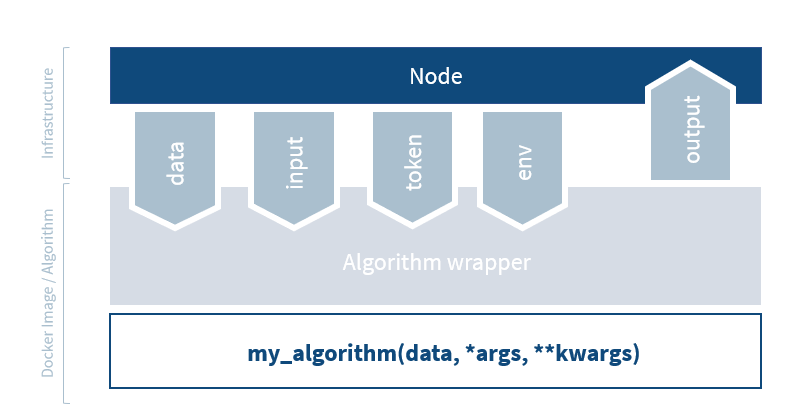

:::::::::::::::::::::::::::::::::::::: questions

- What do the algorithm tools in vantage6 provide?
- How do you create a personalized boilerplate using the v6 cli?
- What is the process for adapting the boilerplate into a simple algorithm?
- How can you test your algorithm using the mock client?
- How do you build your algorithm into a docker image?
- How do you set up a local test environment using the v6 cli (`v6 dev`)?
- How can you publish your algorithm in the algorithm store?
- How can you run your algorithm?

::::::::::::::::::::::::::::::::::::::::::::::::

::::::::::::::::::::::::::::::::::::: objectives

- Understand the available algorithm tools
- Create a personalized boilerplate using the v6 cli
- Adapt the boilerplate into a simple algorithm
- Test your algorithm using the mock client
- Build your algorithm into a docker image
- Set up a local test environment using the v6 cli (`v6 dev`)
- Publish your algorithm in the algorithm store
- Run your algorithm in the UI
- Run your algorithm with the Python client

::::::::::::::::::::::::::::::::::::::::::::::::

## Introduction

The goal of this lesson is to develop a simple average algorithm, and walk through
all the steps from creating the proper code up until running it in the User Interface
and via the Python client. We will start by explaining how the algorithm
interacts with the vantage6 infrastructure. Then, you will start to build, test and run
your own algorithm.

## Algorithm tools

The vantage6 infrastructure provides a set of tools to help you develop your
algorithm. You have probably already done this in the [setup](../learners/setup.md) of the workshop, but you can install the algorithm tools with:

```bash
pip install vantage6-algorithm-tools
```

The following sections handle the most important parts of the algorithm tools.

### Algorithm client

The algorithm client provides functionality that is similar to the Python client, but
can only do a subset of the operations, because the algorithm is not allowed to execute
operations like creating a collaboration or deleting a user. This client can be used to
interact with the server, e.g. to create a subtask, retrieve
results, or get the organizations participating in the collaboration.

A typical example of how to use the algorithm client is as follows:

```python
from vantage6.algorithm.client import AlgorithmClient
from vantage6.algorithm.tools.decorators import algorithm_client

# Load the algorithm client to interact with the server
@algorithm_client
def central_function(client: AlgorithmClient):
    organizations_in_collaboration = client.organization.list()

    task = client.task.create(
        input_=**my_input,
        organizations=organizations_in_collaboration,
        name="Subtask name",
    )

    results = client.wait_for_results(task.get('id'))

    return aggregate_results(results)

```

### Data loading

The algorithm tools provide a way to load the data from the node and provide it to the
algorithm as a Pandas dataframe.

Example:

```python
import pandas as pd
from vantage6.algorithm.tools.decorators import data

# Load two data sources from the node
@data(2)
def partial_function(df1: pd.DataFrame, df2: pd.DataFrame, column: str):
    return {
        "sum1": df1[column].sum(),
        "sum2": df2[column].sum()
    }

```

### Wrapping the algorithm functions

The algorithm client and data loading tools provide you with the vantage6 tools in the
algorithm code itself. However, the algorithm tools also provide an interface between
the algorithm and the node, which we call the algorithm wrapper. The wrapper ensures
that all the necessary information is passed to the algorithm, and that the output is
returned to the server. Mostly this is 'magic' that happens in the background. It is
important to know about it though, as it can help you understand how the algorithm
interacts with the vantage6 infrastructure, and you can use the wrapper to e.g. pass
environment variables to the algorithm.



The following items are handled by the wrapper:

- **Input handling**: the algorithm tools read the input from the node and provide it
  to the arguments of the algorithm function. In the example above, the `column` argument
  is provided by the node to the function via the algorithm tools.
- **Environment variables**: the algorithm tools get the environment variables from the
  node and pass them on to the algorithm. You can also define environment variables in the
  node configuration file that are passed to the algorithm. This can e.g. be useful if
  you want to pass the database connection string to the algorithm.
- **Token**: the algorithm tools ensure that the algorithm uses the security token
  to be able to get the allowed resources from the server.
- **Data**: while the actual data is handled by the `@data` decorator, the algorithm tools
  provide the decorator with environment variables so that it knows where to find the data.
- **Output handling**: the output from the algorithm functions is written to a file
  that the node will send back to the server.

It is possible to write your algorithm without the algorithm tools. If you
want to write your algorithm in a different language than Python, you cannot use the
algorithm tools.

For more information about the algorithm tools, please check out the relevant
[documentation][algo-concepts].

::::::::::::::::::::::::::::::::::::: challenge

## Challenge 1: Creating non-Python algorithms

You want to create a vantage6 algorithm, but Python is not your favorite programming
language. What extra work do you need to do to create a vantage6 algorithm in a
different language?

:::::::::::::::::::::::: solution

## Solution

You would need to implement parts of the wrapper and algorithm client yourself:

- You should use the environment variables to load the token, input and data
- You should create your own HTTP requests to replace the algorithm client
- You should make sure the output is written to the correct place

:::::::::::::::::::::::::::::::::
::::::::::::::::::::::::::::::::::::::::::::::::

## Create a simple algorithm

As discussed above, vantage6 algorithms require a certain structure to interact properly
with the vantage6 infrastructure. For example, vantage6 requires the functions in the
algorithm to be at the base level of a Python
package that is defined within the Docker image. Such requirements can be cumbersome to
get right if you have to write all the code yourself. Fortunately, vantage6 provides
tools to create a boilerplate for you, so that you can focus on the development of your
algorithm functions rather than worry about the infrastructure.

To create a personalized boilerplate, use the vantage6 CLI. You should have installed
the CLI in the [workshop setup](../learners/setup.md). Be sure to activate the
[conda environment](../learners/setup.md#python-environment-and-python-packages) you created for the workshop.

You can create a new algorithm boilerplate repository with:

```bash
v6 algorithm create
```

The first step in creating your own algorithm is to enter the command `v6 algorithm create`
and type along to create your own personalized boilerplate:

```bash
> v6 algorithm create
? Name of your new algorithm: my-vantage6-average
? Directory to put the algorithm in: \some\local\directory\for\algorithms\my-vantage6-average

Welcome to the vantage6 algorithm template creator!

You will be asked a series of questions to generate the basis of your new
vantage6 algorithm in Python.

🎤 Please enter a short description (one sentence) of your algorithm.
   My very first vantage6 algorithm, computing the average of a single data column
🎤 The open source license to use
   MIT
🎤 Do you want to use a central function in your algorithm?
   Yes
🎤 What is the name of your central function?
   central
🎤 Do you want to use a client in your central function?
   Yes
🎤 Do you want to use data in your central function?
   No
🎤 Add a list of arguments to the central function 'central'
    (Finish with 'Alt+Enter' or 'Esc then Enter')
> [
    "column"
  ]
🎤 Do you want to use a partial function in your algorithm?
   Yes
🎤 What is the name of your partial function?
   partial
🎤 Do you want to use a client in your partial function?
   No
🎤 Do you want to use data in your partial function?
   Yes
🎤 How many databases do you want to use in your partial function?
   1
🎤 Add a list of arguments to the partial function 'partial'
    (Finish with 'Alt+Enter' or 'Esc then Enter')
> [
    "column"
  ]
🎤 Do you want to add documentation to your algorithm?
   No
🎤 Do you want to see the advanced options?
   No
```

That should give you a nice head-start to develop your own algorithm!

::::::::::::::::::::::::::::::::::::: challenge

## Challenge 2: Learn about your personalized boilerplate

Inspect your personalized boilerplate code. What does it contain? Multiple answers are
possible.

A. Templates of your algorithm functions
B. Arguments of your algorithm functions
C. Scripts to test your algorithm functions
D. Checklist of what to do to complete your algorithm
E. A JSON file that helps to include the algorithm in an algorithm store

:::::::::::::::::::::::: solution

## Solution

The answers is that it contains _all_ those things. The boilerplate was designed to
be as complete as possible!

A. Templates of your algorithm functions: the boilerplate contains the central and
partial functions that you specified in the creation process, in the files
`central.py` and `partial.py`, in the folder with the algorithm name you specified
in the first question.
B. Arguments of your algorithm functions: within the files specified in the previous
point, you can see that the parameters are already defined in the function signature.
C. Scripts to test your algorithm functions: the boilerplate contains a `test.py` file
in the `test/` directory. Some details still need to be adjusted to test your
algorithm - we'll come to that later in this lesson.
D. Checklist of what to do to complete your algorithm: the `README.md` file in the root
directory of your algorithm contains a checklist of what you need to do to complete
your algorithm.
E. A JSON file that helps to include the algorithm in an algorithm store: the boilerplate
contains an `algorithm_store.json` file that contains a JSON description of your
algorithm. This file is used to upload your algorithm to the algorithm store.

Missing anything? Let us know!

:::::::::::::::::::::::::::::::::
::::::::::::::::::::::::::::::::::::::::::::::::

### Modifying the boilerplate

If you want to modify the answers you gave in `v6 algorithm create`, you can do so by
running:

```bash
v6 algorithm update --change-answers
```

This is recommended to do whenever you want to change something like the name of the
function, as it will ensure that it will be updated in all places it was mentioned.

The update command can also be used without `--change-answers` to update your algorithm
to a new version, even
after you have implemented your functions. This is helpful when there is new
functionality or changes in vantage6 that require algorithms to update.

### Implement the algorithm functions

Your personalized boilerplate is now ready to be adapted into a simple algorithm. We
are now going to implement the average algorithm in several steps. First, we will
explain how this can be done, and then you can try it yourself in a challenge.

First step is to implement the central and partial functions. The easiest is to start
with the partial function. Using the Pandas dataframe that is provided by the algorithm
tools, the following should be extracted for the requested column:

- The number of rows that contains a number
- The sum of all these numbers

The boilerplate code for the central function already a large part of the code that will
be required to gather the results from the partial functions. To compute the final
average, we will need to:

- Modify how the subtasks are created - we need to provide the column to the partial
  functions
- Combine the results from the partial functions to compute the average

Remember that both functions should return the results as valid JSON serializable
objects - we recommend returning a Python dictionary.

### Test your algorithm using the mock client

As discussed before, the algorithm tools contain an algorithm client that helps the
algorithm container to communicate with the server. When testing your algorithm,
it would be cumbersome to test your algorithm in the real infrastructure on every code
change, as this requires you to build your algorithm Docker image, ensure all nodes in
your collaboration are online, etc.

To facilitate the testing phase, the algorithm tools also provide an algorithm mock
client. This client can be used to test your algorithm locally
without having to start up the server and nodes. The mock client provides the same
functions as the algorithm client, but instead of communicating with the server, it
simply returns a smart mock response. The mock client does _not_ mock the output
of the algorithm functions, but actually calls them with locally defined test data.
This way, you can easily test locally if your algorithm functions give the answer you
expect without worrying about the infrastructure.

Your personalized template already contains a `test/test.py` file that contains
boilerplate code to test your algorithm. You just need to make small adjustments to test
your average algorithm.

::::::::::::::::::::::::::::::::::::: challenge

## Challenge 3: Implement the functions and test them

Implement your partial and central functions as described above.

Adapt and run `test.py` to test your function implementation:

- In your Python environment, run `pip install -e .`. This installs the local Python
  package and also the algorithm tools (which contain the mock client).
- Adjust `test.py` to compute the average over the **Age** column. Do this both
  for the test of the central and of the partial function
- Run `test.py` to test your functions.

:::::::::::::::::::::::: hint

We provide a [pandas dataframe](https://pandas.pydata.org/pandas-docs/stable/reference/api/pandas.DataFrame.html). Pandas is a well-known Python library for data manipulation and analysis. It also provides a [sum](https://pandas.pydata.org/docs/reference/api/pandas.DataFrame.sum.html#pandas.DataFrame.sum) method that can be used to calculate the sum of a column.

:::::::::::::::::::::::::::::

:::::::::::::::::::::::: solution

## Solution

You can find the solution in the
[workshop-average-boilerplate repository](https://github.com/vantage6/workshop-average-boilerplate/tree/implemented-functions).
This branch contains the implementation of the average algorithm. Below is a description
of what you need to change compared to the boilerplate you generated in Challenge 1.

In your central function:

- When creating the subtask, fill in the `column` argument from the input parameters.
- Aggregate the results from the partial functions to compute the average, which may look
  something like this:

```python
def central_function(client: AlgorithmClient, column: str):

    ...

    results = client.wait_for_results(task_id=task.get("id"))

    info("Computing global average")
    global_sum = 0
    global_count = 0
    for output in results:
        global_sum += output["sum"]
        global_count += output["count"]

    # return the final results of the algorithm
    return {"average": global_sum / global_count}
```

In your partial function:

- Extract the column from the dataframe and calculate the sum and count of the column
  values. The output should be a dictionary with the keys `sum` and `count`:

```python

@data(1)
def partial_function(df: pd.DataFrame, column: str) -> Any:
    col_data = df[column]
    local_sum = float(col_data.sum())
    local_count = len(col_data)
    return {"sum": local_sum, "count": local_count}
```

In test.py:

- In the `client.task.create()` calls, replace the `column` argument with the column
  you want to calculate the average over: `"Age"`.

Then, you can run `python test/test.py` and the output should look something like:

```

[{'id': 0, 'name': 'mock-0', 'domain': 'mock-0.org', 'address1': 'mock', 'address2': 'mock', 'zipcode': 'mock', 'country': 'mock', 'public_key': 'mock', 'collaborations': '/api/collaboration?organization_id=0', 'users': '/api/user?organization_id=0', 'tasks': '/api/task?init_org_id=0', 'nodes': '/api/node?organization_id=0', 'runs': '/api/run?organization_id=0'}, {'id': 1, 'name': 'mock-1', 'domain': 'mock-1.org', 'address1': 'mock', 'address2': 'mock', 'zipcode': 'mock', 'country': 'mock', 'public_key': 'mock', 'collaborations': '/api/collaboration?organization_id=1', 'users': '/api/user?organization_id=1', 'tasks': '/api/task?init_org_id=1', 'nodes': '/api/node?organization_id=1', 'runs': '/api/run?organization_id=1'}]
info > Defining input parameters
info > Creating subtask for all organizations in the collaboration
info > Waiting for results
info > Mocking waiting for results
info > Results obtained!
info > Mocking waiting for results
[{'average': 34.666666666666664}]
{'id': 2, 'runs': '/api/run?task_id=2', 'results': '/api/results?task_id=2', 'status': 'completed', 'name': 'mock', 'databases': ['mock'], 'description': 'mock', 'image': 'mock_image', 'init_user': {'id': 1, 'link': '/api/user/1', 'methods': ['GET', 'DELETE', 'PATCH']}, 'init_org': {'id': 0, 'link': '/api/organization/0', 'methods': ['GET', 'PATCH']}, 'parent': None, 'collaboration': {'id': 1, 'link': '/api/collaboration/1', 'methods': ['DELETE', 'PATCH', 'GET']}, 'job_id': 1, 'children': None}
info > Mocking waiting for results
[{'sum': 624.0, 'count': 18}, {'sum': 624.0, 'count': 18}]

```

Hence, the average age is 34.67!

:::::::::::::::::::::::::::::::::
::::::::::::::::::::::::::::::::::::::::::::::::

## Build your algorithm into a docker image

To be able to run your algorithm in the vantage6 infrastructure, you need to make
your algorithm available online. To do so, you need access to a Docker
registry. The easiest way to do this is to use Dockerhub. To create an account there,
go [here](https://app.docker.com/signup?).

Your algorithm boilerplate contains a `Dockerfile` in the root folder. Enter the
following commands to build your algorithm into a docker image. Be sure to replace
`$myusername` with your Dockerhub username.

```bash
cd /go/to/directory/with/my/algorithm/and/the/dockerfile
docker login
docker build -t $myusername/average .
docker push $myusername/average
```

This uses the command `docker build` to build your algorithm into a Docker image, and
then the image is uploaded with `docker push`.

## Set up a local test environment

When the algorithm image is available, it is recommended to test locally if it also works
with an actual server and nodes - not just using the mock client. In this section, we
will test your algorithm via vantage6 on your own machine. The easiest way to
set up a server and a few nodes locally is with:

```bash
v6 dev create-demo-network
```

This command creates a vantage6 server configuration, and then registers a
collaboration with 3 organizations in it. It registers a node for each organization and
finally, it creates the vantage6 node configuration for each node with the correct API
key.

Each node in the `v6 dev` network has part of a dataset on olympic medal winners in the
2016 Olympics. The dataset contains the columns `Age`, `Sex`, `Height`, `Weight`, `Country`,
`Sport` and `Medal`. We are mainly interested in the `Age` column for our average
computation, but of course you can also compute the average over other columns, as long
as they are numeric.

The other available commands are:

```bash
# Start the server and nodes
v6 dev start-demo-network

# Stop the server and nodes
v6 dev stop-demo-network

# Remove the server and nodes
v6 dev remove-demo-network
```

In [Chapter 5](./chap5_python_client.md), you have learned how to run an algorithm using the Python
client. Now, you can run your own algorithm using the Python client!

::::::::::::::::::::::::::::::::::::: challenge

## Challenge 4: Test your algorithm on a local vantage6 network

Create and start a local vantage6 network with the `v6 dev` commands. Then, run your
algorithm using the Python client. Note that the data in the `v6 dev` network is
different from the mock data you used before - however it contains the same column "Age".

If you are on Linux and are _not_ using Docker Desktop, you will need to run
`v6 dev create-demo-network --server-url http://172.17.0.1` - this to let vantage6 know
where they can reach localhost from within the Docker container.

You can use the following data to login:

```python
# login credentials
username = "dev_admin"
password = "password"

# server details
server_url = "http://localhost"
port = 7601
api_path = "/api"

# task details
databases = [{"label": "default"}]
column_name = "Age"
```

::::::::::: hint

Use `help(client.task.create)` to see the available arguments for the `create` method.
Your command should be similar to the command in the test script, but with the correct
collaboration/organization ID

:::::::::::

:::::::::::::::::::::::: solution

## Solution

After doing `v6 dev create-demo-network` and `v6 dev start-demo-network`, you can run
the following Python script to run your algorithm on the local network. Take care to
provide the correct username, password, and image name.

```python

from vantage6.client import Client
client.authenticate(username, password)

image = "myusername/average"

task = client.task.create(
    input_={
        "method": "central_function",
        "kwargs": {
            "column": "Age",
        },
    },
    organizations=[1],
    databases = [{"label": "default"}],
    name="test task",
    description="My description",
    collaboration=1,
    image=image
)
results = client.wait_for_results(central_task.get("id"))
print(results)
```

which should print:

```
{'data': [{'result': '{"average": 27.613448844884488}',
   'task': {'id': 2, 'link': '/api/task/2', 'methods': ['DELETE', 'GET']},
   'run': {'id': 4, 'link': '/api/run/4', 'methods': ['GET', 'PATCH']},
   'id': 4}],
 'links': {'first': '/api/result?task_id=2&page=1',
  'self': '/api/result?task_id=2&page=1',
  'last': '/api/result?task_id=2&page=1'}}
```

So the average age is 27.61!

::::::::::::::::::::::::::::::::::::::::::::::::
:::::::::::

## Publish your algorithm in the algorithm store

[Previously](./chap3_run_analysis_ui.md), we have discussed how to run algorithms from the algorithm store.
Now, it is time to publish your own algorithm in the algorithm store. This is required
if you want to run your algorithm in the user interface: the user interface gathers
information about how to run the algorithm from the algorithm store. For example, this
helps the UI to construct a dropdown of available functions, and to know what arguments
the function expects.

The boilerplate you create should already contain an `algorithm_store.json` file that
contains a JSON description of your algorithm - how many databases each function uses,
for example.

You can put the algorithm in the store by selecting the local algorithm store in the UI. You
should upload this algorithm into your local test store, which is part of the `v6 dev`
network. You can do this by selecting that store in the UI, and then by
clicking on the "Add algorithm" button on the page with approved algorithms. You can
upload the `algorithm_store.json` file in the top. After uploading it, you can
change the details of the algorithm before submitting it.

::::::::::::::::::::::::::::::::::::: challenge

## Challenge 5: Add your algorithm to the algorithm store

Your local `v6 dev` network is running an algorithm store locally on `http://localhost:7602`,
and a user interface on `http://localhost:7600`. Log in to the UI and upload your
algorithm to the algorithm store. Note: the UI requests a link to your code - you can
fill in a dummy link for now.

Then, can you download the revised JSON file so you can update it in your algorithm
repository?

:::::::::::::::: hint

Use the `algorithm_store.json` which is present in your algorithm code repository to fill
in most of the details. Note, however, that not everything is prefilled and you also
need to adjust some existing fields. Which fields do you need to adjust?

::::::::::::::::

:::::::::::::::::::::::: solution

## Solution

Go to the UI and log in. Then, go to the 'Algorithm store' section and select the local
algorithm store. Go to 'Approved algorithms', click on 'Add algorithm' and upload the
`algorithm_store.json` file. Fill in the correct image name and set the type of the
argument 'column' to 'Column' (this will ensure that the UI displays a dropdown of
all available columns).

You can find the revised JSON file on the page with the algorithm details.

::::::::::::::::::::::::::::::::::::::::::::::::
::::::::

::::::::::::::::::::::::::::::::::::: challenge

## Challenge 6: Run your algorithm in the UI

Run your algorithm in the UI. The `v6 dev` network should already provide you with
a collaboration where all nodes are online.

Verify that the average age is still the same. Can you also get the average height and
weight?

:::::::::::::::::::::::: solution

## Solution

1. Make sure that your `v6 dev` network is running. If not, start it again with `v6 dev start-demo-network`.
2. Login to the UI, go to 'Analyze' section, select 'Task' and 'Create task'.
3. Select your algorithm from the dropdown.
4. Fill in the required fields. You should select the central function and provide the
   column you want to calculate the average over.
5. Your algorithm should run successfully in the UI. The result should - obviously - be the same as
   when you ran it with the Python client, so we are expecting:

`Average ~= 27.61`.

Similarly, you can get the average height at 178.5 and the average weight at 74.3.

::::::::::::::::::::::::::::::::::

::::::::::::::::::::::::::::::::::::::::::::::::

::::::::::::::::::::::::::::::::::::: challenge

## Challenge 7 (Advanced): Calculate the average per group

Extend your algorithm to answer the following question: in the `v6 dev` dataset, are
gold medal winners older or younger than silver medal winners?

:::::::::::::::: hint

Add a `group_by` argument to both the central and the partial function. Pass this
argument to the partial function when creating the subtask, and use it in the partial
function to group the data.

::::::::::::::::

:::::::::::::::::::::::: solution

A working solution is provided in the
[workshop-average-boilerplate repository](https://github.com/vantage6/workshop-average-boilerplate/tree/advanced-challenge).
Of course, multiple solutions are possible. Below is a description of what you need to
change compared to the algorithm implementation you created in Challenge 2.

Your partial function may now look like this:

```python
@data(1)
def partial_function(df: pd.DataFrame, column, group_by) -> Any:
    """Decentral part of the algorithm"""

    grouped = df.groupby(group_by)
    return {
        "sum": grouped[column].sum().to_dict(),
        "count": grouped[column].size().to_dict(),
    }
```

Your central function should be adapted to pass the `group_by` argument to the partial
function, and it should aggregate the results per group, as something like this:

```python

def central_function(client: AlgorithmClient, column: str, group_by: str):

    ...

    results = client.wait_for_results(task_id=task.get("id"))

    global_sums = {}
    global_counts = {}
    for output in results:
        for key, value in output["sum"].items():
            if key not in global_sums:
                global_sums[key] = 0
            global_sums[key] += value
        for key, value in output["count"].items():
            if key not in global_counts:
                global_counts[key] = 0
            global_counts[key] += value

    results = {}
    for key, value in global_sums.items():
        results[key] = value / global_counts[key]

    return results
```

And when running this, the final results are:

```
{"Bronze":27.39364035087719,"Gold":27.86445366528354,"Silver":27.637515842839036}
```

Gold medal winners are older than silver medal winners. Practice makes perfect!

In case you also aspire to be perfect, feel free to practice some more. Be creative and
think of other questions you can answer with this dataset!

::::::::::::::::::::::::::::::::::

::::::::::::::::::::::::::::::::::::::::::::::::

## Next steps

Congratulations! You have successfully developed your first vantage6 algorithm. You have learned
how to create a personalized boilerplate, implement the algorithm functions, and run the
algorithm using the Python client and the UI. The resulting algorithm, however, is not
suitable yet for real-world use. For instance, if a node contains only a single data
point for a given column, there are no guards implemented that prevent that such
sensitive data is shared with the server. The following steps are usually important
to address before your algorithm is ready for real-world use:

- **Privacy guards**: implement privacy guards to ensure that sensitive data is not
  shared with the server.
- **Error handling**: implement error handling to ensure that the algorithm does not
  crash when unexpected input is provided. Note that there are [custom vantage6 errors][v6-errors]
  that you can raise to provide more information about what went wrong.
- **Documentation**: document your algorithm so that others can understand how to use
  it, what their data should look like, how to interpret the results, etc.

Other next steps could be to extend the algorithm with more functionality, such as
allowing to calculate the average over multiple columns, or to add a `group_by`
argument to compute the average per group.

In the final lesson of this course, you will have the opportunity to work on your own
projects. You can also use that to further develop your algorithm!

## Future changes

### Sessions

We are currently using vantage6 version 4.7. The vantage6 team is working on vantage6
version 5.0, which will bring changes to the algorithm development process. Version 5.0
will introduce sessions, which are a way to split up the algorithm into smaller parts:
data preparation, data preprocessing, data analysis, and post-processing. A major
advantage of this is that extensive data preparation only needs to be done once per
node instead of once per task, which can save a lot of time. Also, it will be possible
for a more experienced user to prepare the data, while a less experienced user can
simply run the algorithm on the prepared data.

For algorithm developers, the sessions mean that you should then split your algorithm
functions into data preparation, analysis, postprocessing, etc. The vantage6 team will
make sure that proper documentation will be available to help you with this transition.

### Algorithm build service

As was already mentioned [previously](./chap2_introduction_v6.md#build-services), the vantage6 team is working on a build service that will automatically build your algorithm into a Docker image. This will alleviate the algorithm developer from having to worry about the Docker image, and will allow them to focus on the algorithm itself. Also, it will ensure that the image
is built in a consistent and secure way, which may enhance the trust in an algorithm image.

::::::::::::::::::::::::::::::::::::: keypoints

- Use `v6 algorithm create` to create a personalized boilerplate
- Implement the partial functions to run on each node and the central function to aggregate the results
- Build your algorithm into a docker image
- Test it with the mock client and with a local `v6 dev` test environment
- Publish your algorithm in the algorithm store to run it in the UI

::::::::::::::::::::::::::::::::::::::::::::::::

[algo-concepts]: https://docs.vantage6.ai/en/main/algorithms/concepts.html
[v6-errors]: https://docs.vantage6.ai/en/main/function-docs/_autosummary/vantage6.algorithm.tools.exceptions.html#module-vantage6.algorithm.tools.exceptions
