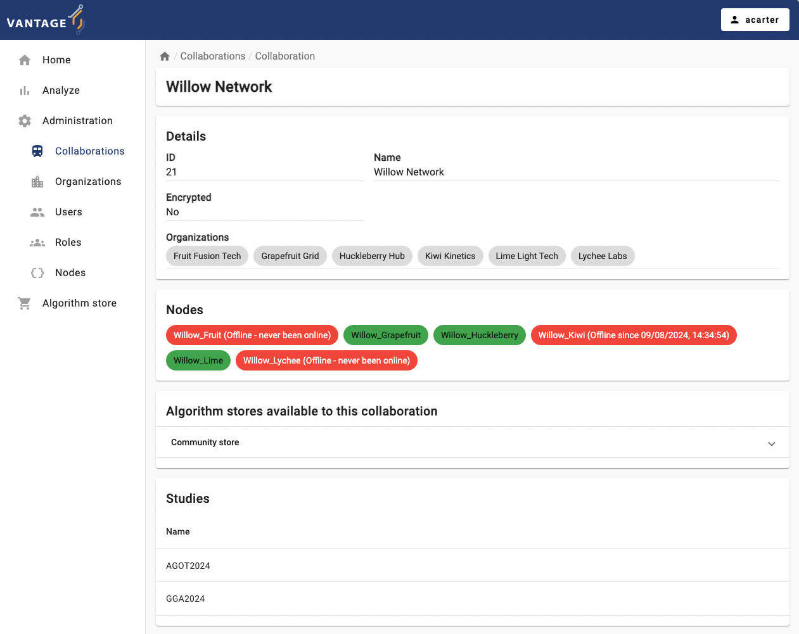

:::::::::::::::::::::::::::::::::::::: questions
- What is a common collaboration scenario where the same institution is involved in multiple collaborations?
- How to check the status of a given collaboration within vantage6?
- How to link an algorithm store to a given collaboration?
- How to request a task based on a given algorithm through vantage6's UI?

:::::::::::::::::::::::::::::::::::::::::::::::::

::::::::::::::::::::::::::::::::::::: objectives

- Explore specific data analysis scenarios that further illustrates the concept of collaboration
- Understand the concept of 'algorithm trustworthiness' in the context of a vantage6 collaboration
- Understand v6's algorithm-store current and envisioned features
- Understand the UI-based approach for performing a data analysis through the given scenarios 

::::::::::::::::::::::::::::::::::::::::::::::::

## A hypothetical case study using vantage6 collaborations

In the context of vantage6, a collaboration refers to an agreement between two or more parties to participate in a study or to answer a research question together. This concept is central to the Privacy Enhancing Technologies (PETs) that vantage6 supports. Each party involved in a collaboration remains autonomous, meaning they retain control over their data and can decide how much of their data to contribute to the collaboration's global model and which algorithms are allowed for execution. 

To illustrate this, let's analyze a hypothetical scenario: two international research projects relying on vantage6 technology on the same server: 

* The first one, __PhY2024__ (Prevalence of hypertension and its association with lifestyle), requires determining the average systolic and diastolic blood pressure levels of the population across France, Spain, and The Netherlands. 
* The second, __GHT__ (Global Health Trends), requires determining the Average BMI across The Netherlands, Spain, and Germany. 

Although both projects are unrelated and independent from each other, the data from Spain and The Netherlands -required by both- is provided by the same large-scale cohort studies, namely CANTABRIA (Spain) and LIFELINES (The Netherlands). However, legal agreements dictate that each project is granted access solely to the data essential for its intended purposes (gaining access to the whole set of variables study increases risks of inference attacks). Data from the French and German population (for __PhY2024__ and __GHT__ studies), on the other hand, will be provided by the GAZEL and GNC prospective cohort studies.

Following vantage6's concepts, this scenario would involve two collaborations, one for each research project. As described in previous episodes, a vantage6 node is needed for each collaboration. Consequently, as illustrated in the diagram below, both CANTABRIA and LIFELINES organizations require two vantage6 data-node instances each. Since each data node defines its own rules for data access and algorithm usage, this ensures that analyses from various collaborations, even those involving shared organizations/datasets, will not conflict with one another.

## Algorithms trustworthiness on a federated setting

While a vantage6-supported research infrastructure like the one described above offers a strong defense against many data privacy risks, there remains one crucial security aspect that falls outside the platform's scope: the validation of the code that will run on this infrastructure. For instance, the administrators of the nodes running within each organization are responsible for defining which algorithms (i.e., [which container images](https://docs.vantage6.ai/en/main/node/configure.html#all-configuration-options)) will be allowed for execution on the respective collaborations. As this is a critical and complex task that entails activities like code analysis and verification, working with algorithms from trusted sources is the primary line of defense against potential threats.

Vantage6's algorithm store feature aims to enhance trustworthiness by offering a centralized platform for managing pre-registered algorithms. This serves as an alternative to using algorithms from unknown authors or those lacking transparency regarding their development process and status. The algorithm store currently allows researchers to explore which algorithms are available and how to run them. This, along with its integration with vantage6's UI, streamlines task execution requests within collaborations.

As of the time of writing this tutorial, efforts are underway to integrate additional information to the algorithms metadata such as creators and code reviewers. Moreover, plans are in place to incorporate the algorithm review process into the publication procedure for any algorithms in the store.

## Running a PET (privacy-enhancing technology) analysis without programming!

In this episode, you will perform a PET analysis on an existing vantage6 collaborations (based on 'dummy' nodes) that resemble the two described above. For reference, the datasets of each organization can be seen here (TODO).

::::::::::::::::::::::::::::::::::::: challenge

## Challenge 1: understanding a simple federated algorithm

First, let's take a look at one of the federated algorithms -available on the vantage6's community store- that will be used in this episode: [a federated average](https://github.com/IKNL/v6-average-py/blob/master/v6-average-py/__init__.py). Based on the code and its comments:

- What is the difference between the 'central_average' and the 'partial_average' functions?
- What would happen if this algorithm is executed within a collaboration that has one of its nodes 'offline'?

::::::::::::::::::::::::::::::::::::::::::::::::

::::::::::::::::::::::::::::::::::::: challenge

## Challenge 2: exploring the status of existing collaborations configured on a vantage6 server

Below are the administrator credential of GHT and PhY24 collaborations (passwords will be given by the instructors).

| User        | Roles               | Collaboration |
| ----------- | ------------------- | ------------- |
| PhY24-admin | Collaboration Admin | PhY24         |
| GHT-admin   | Collaboration Admin | GHT           |

Check the status of the nodes of each collaboration. Log in to each one with the given credentials, click on 'Administration' on the top of the UI, select 'Collaborations' on the left panel, and then select the corresponding collaboration. If there are 'offline' nodes, click on the 'Nodes' panel on the left and check when these were seen for the last time.

- Based on what you see on Challange #1, which collaboration would be ready to request the 'Average' algorithm on it?
- For the other collaboration, which organization you would need to reach in order to fix the issue?

You will now link the 'community-store' to the collaboration whose nodes are ready for it. 

1. Login into the organization using the corresponding credentials from above. 
2. Click on 'Administration' on the top of the UI, select 'Collaborations' on the left panel, and then select the corresponding collaboration.
3. Click on '+ Add algorithm store'
4. Add the vantage6's community store. Use any descrption as name, and provide community store URL: `https://store.cotopaxi.vantage6.ai`
5. Make sure the store is now shown on the collaboration details:

::::::::::::::::::::::::::::::::::::::::::::::::

::::::::::::::::::::::::::::::::::::: challenge
## Challenge 3: your first algorithm execution as a researcher

Now, you'll take on the role of the researcher within the collaboration for which you've just established the algorithm store. With this role, you will finally request the execution of the algorithm. 

1. log in as a researcher using the corresponding credentials below:

    |  User  |  Roles   |  Collaboration   |
    |----|-----|-----|
    |PhY24-rs1  | Researcher    |PhY24      |
    |GHT-rs1  | Researcher    |GHT    |

2. Select the collaboration given on the front page, and select 'Tasks' from the panel on the left.
    

3. If you have set up everything correctly, the 'Average' algorithm should be now listed under the '*Select which algorithm you want to run*' dropdown menu. Select it, and provide a name and a description.

    

4. Now the UI will let you choose between the two functions you explored in Challenge #1. First, try to run the 'partial_average' on all the nodes individually.

    

5. Select the 'default' database, choose any numerical column as a parameter, and then click on 'Submit'.

6. The task you just requested should be listed with a 'pending' status. Once finished, explore and download the provided results:
    

   - Based on your understanding of the 'central_average' function, if you create one a new task, which organization nodes should you choose this time in order to actually calculate the overall (across all the datasets) average? Experiment with this and discuss the results with the instructors.
   - What would happen if you select an alpha-numerical column (e.g., 'participant_pseudo_id')? Do this experiment and explore the generated error logs. Discuss with the instructors how these logs can be used to diagnose any task execution issues.

::::::::::::::::::::::::::::::::::::::::::::::::

