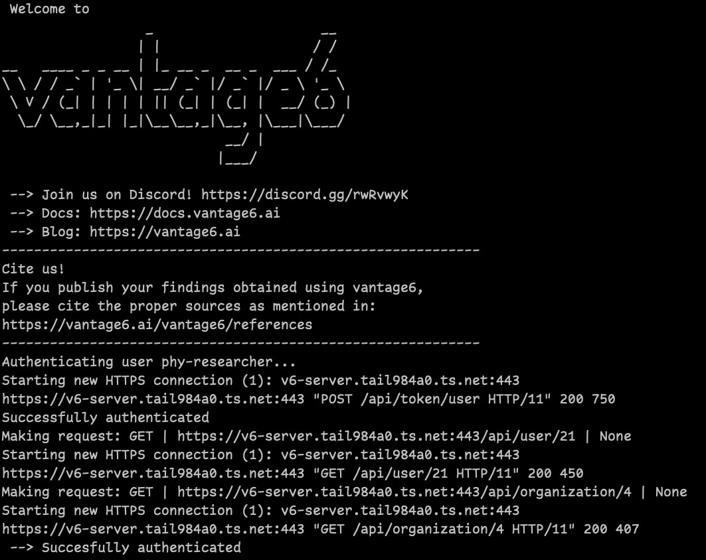

:::::::::::::::::::::::::::::::::::::: questions
- What is a common collaboration scenario where the same institution is involved in multiple collaborations?
- How to check the status of a given collaboration within vantage6?
- How to link an algorithm store to a given collaboration?
- How to request a task based on a given algorithm through vantage6's UI?

:::::::::::::::::::::::::::::::::::::::::::::::::

::::::::::::::::::::::::::::::::::::: objectives

- Explore specific data analysis scenarios that further illustrate the concept of collaboration
- Understand the concept of 'algorithm trustworthiness' in the context of a vantage6 collaboration
- Understand v6's algorithm-store current and envisioned features
- Understand the UI-based approach for performing a data analysis through the given scenarios 

::::::::::::::::::::::::::::::::::::::::::::::::

# Vantage6 Python client - basic concepts

The vantage6 Python client is a library designed to facilitate interaction with the vantage6 server, enabling automation of various tasks such as creating computation tasks, managing organizations, collaborations, users, and collecting results. It communicates with the server through its API, handling encryption and decryption of data for secure operations. The client aims to comprehensively support all aspects of server communication, making it a crucial tool for users looking to leverage the full capabilities of the vantage6 platform programmatically.

### Client configuration

``` python
# config.py

server_url = "https://<vantage6-server-address>" 
server_port = 443 
server_api = "/api" 

username = "MY USERNAME"
password = "MY PASSWORD"

organization_key = "" # Path to the encryption key, if encryption is enabled
```

### Creating a client instance

``` python
from vantage6.client import UserClient as Client

# Note: we assume here the config.py you just created is in the current directory.
# If it is not, then you need to make sure it can be found on your PYTHONPATH
import config

# Initialize the client object, and run the authentication
client = Client(config.server_url, config.server_port, config.server_api,
                log_level='debug')
client.authenticate(config.username, config.password)

# Optional: setup the encryption, if you have an organization_key
client.setup_encryption(config.organization_key)
```

### Using the client

The client instace, once created, offers a set of attributes that correspond to the vantage6 core concepts (See concept map). 

- `client.user`
- `client.organization`
- `client.rule`
- `client.role`
- `client.collaboration`
- `client.task`
- `client.result`
- `client.util`
- `client.node`


Each of these attributes, in turn, provides an abstraction of the CRUD (Create, Read, Update and Delete) operations that can be performed to its corresponding concept. Please note that some resources do not provide all four, and that these operations are constrained to the privileges of the credentials used when creating the client instance:

```Python
# Get all the instances of the given '<resource>' in the server. For example, client.task.organization() returns all the organizations registered on the server.
client.<resource>.list()
```
````Python
# Create and register a new instace of <resource> in the server.
client.<resource>.create()
````
````Python
# Delete an specific instance of the given '<resource>'.
client.<resource>.delete()
````
````Python
# Get an specific instance of the given '<resource>'.
client.<resource>.get()
````

The parameters of the methods above differ depending on the kind of `<resource>` you are working on. To get these details, you can launch a Python interactive session that runs the client creation script above, and then use the 'help' command. For example, by doing this for `client.organization`, you will find that you can filter the list of organizations (among others) by name, country and collaboration.

```Python
python -i client.py
>>> help(client.organization)

|  list(self, name: 'str' = None, country: 'int' = None, collaboration: 'int' = None, study: 'int' = None, page: 'int' = None, per_page: 'int' = None) -> 'list[dict]'
 |      List organizations
 |      
 |      Parameters
 |      ----------
 |      name: str, optional
 |          Filter by name (with LIKE operator)
 |      country: str, optional
 |          Filter by country
 |      collaboration: int, optional
 |          Filter by collaboration id. If client.setup_collaboration() was called,
 |          the previously setup collaboration is used. Default value is None
 
```

For consistency, all the methods of the client API use identifiers rather than names. So, if you want to perform a certain operation for a given resource, you will need to get these identifers first.

For example, if you need to know the identifiers the collaborations you have access to, you can use the `list()` function of the `client.collaboration` resource:

``` Python
# Get all the details of all the collaborations you have access to:
client.collaboration.list()

# Alternatively, to show only the 'id' and 'name' of each collaboration:
client.collaboration.list(fields=['id', 'name'])
```

To get the details organizations that are part of a given collaboration

``` Python
# Get all the organizations that are part of a collaboration whose identifier is 45:
client.organization.list(collaboration=45)

# Get all only the id and name of the organizations that are part of a collaboration whose identifier is 45:
client.organization.list(collaboration=45, fields=['id', 'name'])
```

### Creating a new task

To create a new task, that is to say, to request the execution of an algorithm on a given organization, in the context of a particular organization, you can use the `create()` method of the `client.task` resource.

As an input for the task creation, a dictionary with 'method' and 'kwargs' keys is required. The 'method' value must contain the name of the function to be executed. The 'kwargs' value must be another dictionary with the properties required by the algorithm. For example, if you want to create a task with the *federated average* algorithm (see original [source code here](https://github.com/IKNL/v6-average-py/blob/master/v6-average-py/__init__.py)), the input would look like this:

```Python
"""
partial_average() is a function defined on the *federated average* algorithm (see algorithm source at https://github.com/IKNL/v6-average-py/blob/master/v6-average-py/__init__.py). Given that 'colum_name' is the argument required by this function, the value for 'kwargs' key must include a dictionary with this property:
"""
input_ = {
    'method': 'partial_average',
    'kwargs': {'column_name': 'age'}
}
```

Once you have defined your task input, you can create and start it by also specifying (using identifiers) on which organizations and for which collaboration, it will be executed. In the following example, the partial_average function of the 'containerized' algorithm on the 'harbor2.vantage6.ai/demo/average' would be executed on the vantage6 nodes created, for the organizations #12 and #23, when setting up the collaboration #45.

```Python
average_task = client.task.create(
   collaboration=45,
   organizations=[12,23],
   name="name_for_the_task",
   image="harbor2.vantage6.ai/demo/average",
   description='',
   input_=input_,
   databases=[
      {'label': 'default'}
   ]
)
```

# Working on the hypothetical case study programatically

::::::::::::::::::::::::::::::::::::: challenge
## Challenge 1 - Setup the node client

The goal of this first challenge is to create a Python script for performing tasks on the case study explored on Chapter 3. It is important to install the Python client with the same version as the vantage6 server you are talking to.  Check your server version by going to `https://SERVER_DOMAIN_NAME/api/version`, using the url of the vantage6 server from Chapter 3.

Create and activate a python environment (conda, venv, etc) and install the `vantage6-client` for this particular server version:

    pip install vantage6==<version>

Use one of the researcher credentials and server URL given to you for Episode 3 to create a configuration file and a script to connect to the server (as described on the guidelines above). 

Execute the script check that the connection is performed successfuly. 

::::::::::::::::::::::::::::::::::::::::::::::::

:::::::::::::::::::::::: solution

:::::::::::::::::::::::::::::::::


::::::::::::::::::::::::::::::::::::: challenge

### Challenge 2: use the client to find the identifiers of your collaboration and its organizations

Use the researcher credentials given to you for Chapter 3, to get the identifiers of the two collaborations you worked with in it. Use this information for getting the identifiers of the organizations that belong to each collaboration. Refer to the __Python client - basic concepts__ section to do this.

|  User     |  Roles        |  Collaboration   |
|-----------|---------------|------------------|
|PhY24-rs1  | Researcher    |PhY24             |
|GHT-rs1    | Researcher    |GHT               |


Now, try to identify, programatically, which nodes are active on each collaboration. Hint: use the `client.node` resource. Remember that you can use the `help()` function to see how to get the details of the nodes of a given organization.


::::::::::::::::::::::::::::::::::::::::::::::::


:::::::::::::::::::::::: solution

``` python
>>> client.collaboration.list(fields=['id', 'name', 'organizations'])


[
    {'id': 4, 'name': 'PhY-research', 'organizations': '/api/organization?collaboration_id=4'}, 
    {'id': 5, 'name': 'GHT_consortium', 'organizations': '/api/organization?collaboration_id=5'}
]
````

Knowing the ID of the collaboration, you can find the identifiers of the organizations that are participating on it:

``` python
>>> client.organization.list(collaboration=4)

[
    {'address1': '', 'studies': '/api/study?organization_id=3', 'users': '/api/user?organization_id=3', 'zipcode': '', 'domain': '', 'tasks': '/api/task?init_org_id=3', 'public_key': '', 'name': 'CANTABRIA_organization', 'address2': '', 'nodes': '/api/node?organization_id=3', 'country': 'Spain', 'collaborations': '/api/collaboration?organization_id=3', 'runs': '/api/run?organization_id=3', 'id': 3}, 
    {'address1': '', 'studies': '/api/study?organization_id=4', 'users': '/api/user?organization_id=4', 'zipcode': '', 'domain': '', 'tasks': '/api/task?init_org_id=4', 'public_key': '', 'name': 'LIFELINES_organization', 'address2': '', 'nodes': '/api/node?organization_id=4', 'country': 'The Netherlands', 'collaborations': '/api/collaboration?organization_id=4', 'runs': '/api/run?organization_id=4', 'id': 4}, 
    {'address1': '', 'studies': '/api/study?organization_id=5', 'users': '/api/user?organization_id=5', 'zipcode': '', 'domain': '', 'tasks': '/api/task?init_org_id=5', 'public_key': '', 'name': 'GAZEL_organization', 'address2': '', 'nodes': '/api/node?organization_id=5', 'country': 'France', 'collaborations': '/api/collaboration?organization_id=5', 'runs': '/api/run?organization_id=5', 'id': 5}, 
    {'address1': '', 'studies': '/api/study?organization_id=7', 'users': '/api/user?organization_id=7', 'zipcode': '', 'domain': '', 'tasks': '/api/task?init_org_id=7', 'public_key': '', 'name': 'PhY24-consortium', 'address2': '', 'nodes': '/api/node?organization_id=7', 'country': '', 'collaborations': '/api/collaboration?organization_id=7', 'runs': '/api/run?organization_id=7', 'id': 7}
]
````

Getting the status of an organization node for a given collaboration. The following returns the nodes (there is a node for each collaboration the organization contributes to).

``` python
>>> client.node.list(organization=4)

[
    {'config': [], 'last_seen': '2024-06-18T06:57:48.114072', 
    'organization': {'id': 4, 'link': '/api/organization/4', 
    'methods': ['PATCH', 'GET']}, 
    'collaboration': {'id': 4, 'link': '/api/collaboration/4', 
    'methods': ['GET', 'PATCH', 'DELETE']}, 
    'name': 'PhY-research - LIFELINES_organization', 'status': 'offline', 
    'type': 'node', 'ip': None, 'id': 13}, 
    {'config': [], 'last_seen': None, 
    'organization': {'id': 4, 'link': '/api/organization/4', 
    'methods': ['PATCH', 'GET']}, 
    'collaboration': {'id': 5, 'link': '/api/collaboration/5', 
    'methods': ['GET', 'PATCH', 'DELETE']}, 
    'name': 'GHT_consortium - LIFELINES_organization', 'status': None, 
    'type': 'node', 'ip': None, 'id': 18}
]
````

:::::::::::::::::::::::::::::::::

::::::::::::::::::::::::::::::::::::: challenge
## Challenge 4: Creating a task that runs the central algorithm**

Now, we have two options: create a task that will run the central part of an algorithm (which runs on one node and may spawns subtasks on other
nodes), or create a task that will (only) run the partial methods (which are run on each node). Typically, the partial methods only run the node
local analysis (e.g. compute the averages per node), whereas the central methods performs aggregation of those results as well (e.g. starts the partial analyses and then computes the overall average). First, let us create a task that runs the central part of the `harbor2.vantage6.ai/demo/average` algorithm:

``` python
input_ = {
    'method': 'central_average',
    'kwargs': {'column_name': 'age'}
}

average_task = client.task.create(
   collaboration=1,
   organizations=[2,3],
   name="an-awesome-task",
   image="harbor2.vantage6.ai/demo/average",
   description='',
   input_=input_,
   databases=[
      {'label': 'default'}
   ]
)
```


Note that the `kwargs` we specified in the `input_` are specific to this algorithm: this algorithm expects an argument `column_name` to be
defined, and will compute the average over the column with that name.
Furthermore, note that here we created a task for collaboration with id `1` (i.e. our `example_collab1`) and the organizations with id `2` and `3` (i.e. `example_org1` and `example_org2`). I.e. the algorithm need not necessarily be run on *all* the organizations involved in the collaboration.

Finally, note that you should provide any databases that you want to use via the `databases` argument. In the example above, we use the `default`
database; using the `my_other_database` database can be done by simply specifying that label in the dictionary. If you have a SQL or SPARQL
database, you should also provide a `query` argument, e.g.

``` python
databases=[
   {'label': 'default', 'query': 'SELECT * FROM my_table'}
]
```

Similarly, you can define a `sheet_name` for Excel databases if you want
to read data from a specific worksheet. Check `help(client.task.create)`
for more information.


**Creating a task that runs the partial algorithm**

You might be interested to know output of the partial algorithm (in this
example: the averages for the \'age\' column for each node). In that
case, you can run only the partial algorithm, omitting the aggregation
that the central part of the algorithm will normally do:

``` python
input_ = {
    'method': 'partial_average',
    'kwargs': {'column_name': 'age'},
}

average_task = client.task.create(collaboration=1,
                                  organizations=[2,3],
                                  name="an-awesome-task",
                                  image="harbor2.vantage6.ai/demo/average",
                                  description='',
                                  input_=input_)
```

**Inspecting the results**

Of course, it will take a little while to run your algorithm. You can
use the following code snippet to run a loop that checks the server
every 3 seconds to see if the task has been completed:

``` python
print("Waiting for results")
task_id = average_task['id']
result = client.wait_for_results(task_id)
```

You can also check the status of the task using:

``` python
task_info = client.task.get(task_id, include_results=True)
```

and then retrieve the results

``` python
result_info = client.result.from_task(task_id=task_id)
```

The number of results may be different depending on what you run, but
for the central average algorithm in this example, the results would be:

``` python
>>> result_info
[{'average': 53.25}]
```

while for the partial algorithms, dispatched to two nodes, the results
would be:

``` python
>>> result_info
[{'sum': 253, 'count': 4}, {'sum': 173, 'count': 4}]
```
::::::::::::::::::::::::::::::::::::::::::::::::