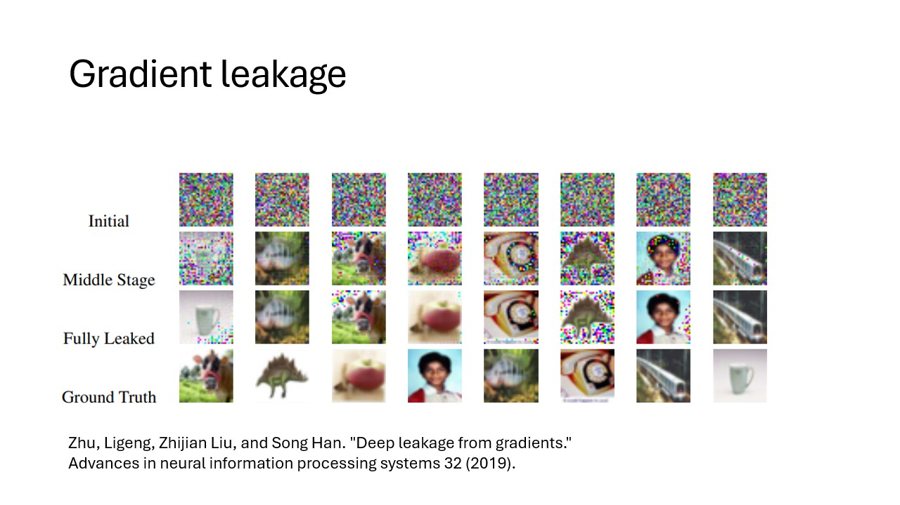

:::::::::::::::::::::::::::::::::::::: questions

- TODO

::::::::::::::::::::::::::::::::::::::::::::::::

::::::::::::::::::::::::::::::::::::: objectives

- Understand PET, FL, MPC, homomorphic encryption, differential privacy
- Understand how different PET techniques relate
- Understand scenarios where PET could be applied
- Understand horizontal vs vertical partitioning
- Decompose a simple analysis in a federated way
- Understand that there is paperwork to be done (DPIA etc.)
  ::::::::::::::::::::::::::::::::::::::::::::::::

## Problem statement

The amount of data being generated nowadays is absolutely mind-boggling. This data can be a valuable
resource for researchers. However, personal data should be handled with great care and
responsibility
because of its sensitive nature. This is why there are privacy regulations in place like
[GDPR](https://gdpr-info.eu/) to prohibit easy access to this wealth of data.

However, often researchers are not interested in the personal records that make up the data, but
rather
in the *insights* derived from it. This raises an intriguing question: Can we unlock these valuable
insights in a manner that upholds and respects privacy standards?

In classic data analysis, all data is copied over into a single place. This makes it very easy to
use
conventional data analysis software and tools to gain insights.

{alt='Two tables
with data are moved to a central location'}

Unfortunately this way of working does not respect the privacy of the people contained within the
dataset. All their personal details end up at another party.

::::::::::::::::::::::::::::::::::::: challenge

## Other problems with copying data

Discuss in groups what other issues you see with handling the data by copying everything into one
central place.

:::::::::::::::: solution

You might think of multiple issues. Some examples:

- The original data owner loses control of the data
- Results in multiple versions of the data
- What to do when the data needs to be updated?
- If there was consent in the first place, how can you retract consent?

:::::::::::::::::::::::::
:::::::::::::::::::::::::::::::::::::::::::::::

## Data anonymization and pseudonymization

The first step in the process is often *data anonymization*. Personal identifiable information
will in this case be removed so that individuals stay anonymous. Data *pseudonimization* is a
similar process, but in this case, the records will be assigned an id that will make it
possible to link individuals across datasets.

{alt='Names are censored before the datasets
are sent to a central place'}

While data anonymization and pseudonymization are often a good first step, there is no guarantee
that the data will never be reidentified. A famous example of reidentification is the story of the
[Netflix prize](https://en.wikipedia.org/wiki/Netflix_Prize). The Netflix prize was an open
competition to build the best recommender system to predict user ratings for films based on previous
ratings. The data was anonymized, but in 2007 two researchers from The University of Texas at Austin
were able to identify a large number of users by matching the dataset with film ratings on the
Internet Movie Database (IMDB).

## Federated data analysis

There are different ways in which privacy risks can be mitigated. We will focus on the idea of
federated analysis. In a federated setting, the data with the data owner, who keeps full control
over it. In this case, it is not the data that travels, but the analysis itself. The system sends
a query or instruction to the data and only the results will get back to the user.
The results are often akin to a form of *aggregation* of the data. This can be in the shape of
traditional
statistics like the mean, or it can be more intricate like a machine learning model.

Aggregating the data does not ensure complete protection of person-level information, but it
certainly makes it less likely that this will happen.

TODO: Example of data leakage in simple aggregated case

## Federated learning

The term federated learning was introduced in 2016 by researchers at Google
[(McMahan et al.)](https://doi.org/10.48550/arXiv.1602.05629) and refers to a "loose federation of
participating devices (which we refer to as clients) which are coordinated by a central server.” In 
traditional federated learning, the clients train machine learning models, and only the updates of
the models are sent back to the central server. The central server combines the updates from all the
individual clients into one final machine learning model.

There are caveats to using this type of data analysis though. Although the data transmitted from the
clients to the server are an aggregation of the raw data, researchers have found a way to use this
data to reconstruct the original data. This vulnerability is called *gradient* leakage.

## Secure Multiparty Computation

There are different solutions to prevent the reconstruction of raw data. One solution is to make
sure that no party other than the data owner is actually able to see the intermediate data. One
branch
of techniques that can be used for this is Secure Multiparty Computation (MPC). With MPC,  
computations are performed collaboratively by multiple parties. Data is encrypted in such a way that
other parties cannot see the original values, but values of multiple parties can still be combined (
e.g. added or
multiplied).
A classic technique from the field of MPC is secret sharing. With this technique data is encrypted,
after which pieces of the encryption are sent to the other parties. No single party will be able to
reconstruct the original value. Only when all parties work together, the original value can be
retrieved.

When combining multiple values using secret sharing, this will result in the parties owning new
puzzle pieces that when put together will reveal the result of the computation.

::: callout

### Secret sharing, an example

Mees, Sara and Noor want to know how much they weigh in total.
Mees weighs 43 kg, Sara weighs 39, Noor weighs 45.
They create secret shares for their weights that they give to their peers.

|                 | Mees receives | Sara receives | Noor receives | Sum |
|-----------------|---------------|---------------|---------------|-----|
| Mees generates: | -11           | 50            | 4             | 43  |
| Sara generates: | -12           | 17            | 34            | 39  |
| Noor generates: | -19           | -38           | 64            | 45  |

They sum their shares:

|      |     |
|------|-----|
| Mees | -4  |
| Sara | 29  |
| Noor | 102 |

They add their sums together: -4 + 29 + 102 = 127
In this way, they have aggregated their data without sharing their individual data with anyone else.
:::
TODO: Exercise with secret sharing where data is leaked.

## Differential privacy

As mentioned before, aggregation of data will not always prevent leaks of sensitive information.
Consider the example of Mees, Sara and Noor. We know their total weight is 127 kg. If Sara and Noor
get together and subtract their weights off of the total, they will be able to infer how much Mees
weighs.

An aggregation is differentially private when someone cannot infer whether a particular individual
was used in the computation. A way to make a result more differentially private is to replace a
selection of inputs with random noise. A single individual will then always be able to deny that
their data has contributed to the final result. An individual has *plausible deniability* with
regards to whether it was
part of the dataset.

## Blocks upon blocks
The previously mentioned techniques are not used in isolation, but are usually stacked on top of
eachother to mitigate the privacy risks that are relevant within a certain usecase.
Typically, the process begins by anonymizing or pseudonymizing the data. With vantage6, the data is
then placed in a federated setting. You can use the existing algorithms available for vantage6,
which often incorporate various privacy-enhancing techniques.

## Data partitioning
Data sharing challenges come in many different shapes and sizes, but in the end, the goal of the
researchers is often to analyze data *as if* it were available in one big table in one place.
There are 2 main ways in which the dataset can be separated over different sources: **horizontal**
and **vertical** partioning. In horizontal partitioning, this giant table has been snipped in pieces
by making horizontal cuts. The result is that information of an individual record will stay in one
place, but the records themselves have been scattered around in different locations.

In vertical partitioning, the cuts have been made vertically. Columns have now been divided over
different locations. This type of partitioning is usually more challenging because often a way needs
to be found to link identities across datasources. Vertical partitioning requires different types
of privacy enhancing algorithms than horizontal partitioning.

In reality, data can be horizontally and vertically partitioned at the same time. It might be
necessary to combine multiple techniques in order to overcome your problems.

## Technology doesn't solve everything

You have now learned about various technologies for analyzing data while preserving privacy of
individuals. However, it should be emphasized that these technologies do not solve all your data
sharing problems. Rather, they are only a small piece of the puzzle. In research projects involving
privacy enhancing technologies, a lot of work goes into complying with regulations and building
trust.

Since these projects have a risk of affecting the privacy of individuals, a Data Protection Impact
Assessment (DPIA)
is usually required. This is a process that will help identify and minimize privacy risks of a
project
and is required by GDPR.

Apart from procedures required by GDPR there might be other regulations in place enforced by the
owners of the data (e.g. hospitals). The specific situation of a project can affect the way in which
the data is allowed to be processed. Some privacy enhancing technologies might be allowed in one
project but prohibited in another. It is always important to stay transparent about privacy risks
of the technologies you intend to use.

::::::::::::::::::::::::::::::::::::: keypoints

- TODO

::::::::::::::::::::::::::::::::::::::::::::::::

[r-markdown]: https://rmarkdown.rstudio.com/
